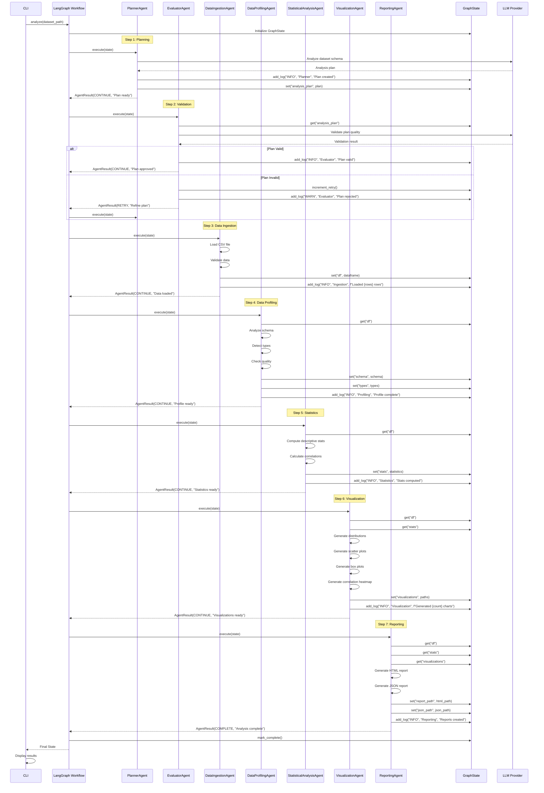

# DataForge AI - Agent Interaction Diagram



## Agent Interaction Patterns

### 1. State Read-Write Pattern

All agents follow the same pattern:

```python
async def execute(self, state: GraphState) -> AgentResult:
    # 1. Read from state
    df = state.get("df")

    # 2. Perform work
    result = self._do_work(df)

    # 3. Write to state
    updated_state = state.set("my_result", result)

    # 4. Log action
    updated_state = updated_state.add_log(
        level="INFO",
        agent=self.name,
        message="Work completed"
    )

    # 5. Return result
    return AgentResult(
        decision=AgentDecision.CONTINUE,
        message="Success"
    )
```

### 2. LLM Interaction Pattern

Agents that use LLMs follow this pattern:

```python
async def execute(self, state: GraphState) -> AgentResult:
    # 1. Prepare prompt
    prompt = self._build_prompt(state)

    # 2. Call LLM
    response = await self.llm.generate(prompt)

    # 3. Parse response
    result = self._parse_response(response)

    # 4. Update state
    return AgentResult(...)
```

### 3. Retry Pattern

When agents need to retry:

```python
async def execute(self, state: GraphState) -> AgentResult:
    try:
        # Attempt work
        result = await self._do_work(state)
        return AgentResult(AgentDecision.CONTINUE, "Success")
    except RecoverableError as e:
        # Increment retry count
        new_state = state.increment_retry()
        if new_state.retry_count < MAX_RETRIES:
            return AgentResult(AgentDecision.RETRY, str(e))
        else:
            return AgentResult(AgentDecision.FAIL, "Max retries exceeded")
```

## Agent Communication Matrix

| From | To | Data Flow | Purpose |
|------|-----|-----------|---------|
| Planner | Evaluator | analysis_plan | Plan validation |
| Evaluator | Planner | validation_result | Plan refinement |
| DataIngestion | DataProfiling | df | Data for profiling |
| DataProfiling | StatisticalAnalysis | schema, types | Context for stats |
| StatisticalAnalysis | Visualization | stats | Stats for charts |
| Visualization | Reporting | visualizations | Charts for report |
| All | GraphState | logs, data | Central state updates |

## Error Propagation

```mermaid
graph TB
    A[Agent Error] --> B{Error Type?}
    B -->|Recoverable| C[Return RETRY decision]
    B -->|Critical| D[Return FAIL decision]

    C --> E[Workflow increments retry_count]
    E --> F{retry_count < 3?}
    F -->|Yes| G[Re-execute agent]
    F -->|No| D

    D --> H[Workflow terminates]
    H --> I[Return error to CLI]

    style C fill:#FFD700
    style D fill:#FFB6C1
    style G fill:#90EE90
    style H fill:#FFB6C1