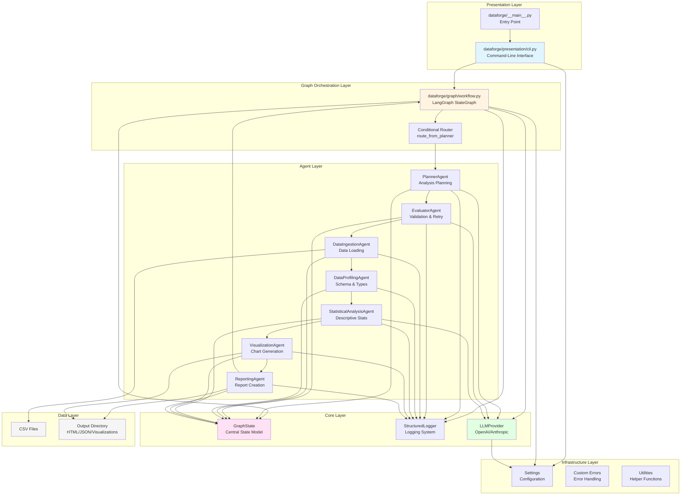

# DataForge AI - Architecture Diagram

## Architecture Overview

### Layer Responsibilities

1. **Presentation Layer**: User-facing CLI interface and entry points
2. **Graph Orchestration Layer**: LangGraph workflow management and routing
3. **Agent Layer**: Seven specialized AI agents for different analysis tasks
4. **Core Layer**: Central state management, logging, and LLM integration
5. **Infrastructure Layer**: Configuration, error handling, and utilities
6. **Data Layer**: Input data sources and output artifacts

### Key Design Principles

- **Single Source of Truth**: GraphState is the only mutable state object
- **Agent Independence**: Each agent operates independently through the state
- **Async-First**: All agents execute asynchronously for performance
- **Type Safety**: Pydantic models enforce data validation
- **Observability**: Structured logging at every step