# DataForge AI - Data Flow Diagram

```mermaid
graph TB
    subgraph "Input Sources"
        CSV[CSV File<br/>datasets/*.csv]
    end

    subgraph "Data Transformation Pipeline"
        INGESTION[DataIngestionAgent<br/>Load & Validate]
        PROFILING[DataProfilingAgent<br/>Schema & Type Analysis]
        STATS[StatisticalAnalysisAgent<br/>Descriptive Statistics]
        VIZ[VisualizationAgent<br/>Chart Generation]
        REPORT[ReportingAgent<br/>Report Compilation]
    end

    subgraph "Data Structures"
        RAW[Raw DataFrame<br/>pd.DataFrame]
        SCHEMA[Schema Dictionary<br/>{col: type, ...}]
        STATS_DICT[Statistics Dictionary<br/>{col: {mean, std, ...}, ...}]
        CHARTS[Chart Files<br/>*.html]
        REPORT_HTML[HTML Report<br/>report.html]
        REPORT_JSON[JSON Report<br/>report.json]
    end

    subgraph "Output Artifacts"
        OUTPUT_DIR[Output Directory<br/>output/{dataset}/]
        VISUALIZATIONS[Visualizations Folder<br/>visualizations/]
        LOGS[Execution Logs<br/>execution_*.log]
    end

    subgraph "State Management"
        STATE[GraphState<br/>Central State]
    end

    CSV --> INGESTION
    INGESTION --> RAW
    RAW --> STATE

    STATE --> PROFILING
    PROFILING --> SCHEMA
    SCHEMA --> STATE

    STATE --> STATS
    STATS --> STATS_DICT
    STATS_DICT --> STATE

    STATE --> VIZ
    VIZ --> CHARTS
    CHARTS --> STATE

    STATE --> REPORT
    REPORT --> REPORT_HTML
    REPORT --> REPORT_JSON
    REPORT_HTML --> STATE
    REPORT_JSON --> STATE

    STATE --> OUTPUT_DIR
    CHARTS --> VISUALIZATIONS
    VISUALIZATIONS --> OUTPUT_DIR
    REPORT_HTML --> OUTPUT_DIR
    REPORT_JSON --> OUTPUT_DIR

    STATE --> LOGS
    LOGS --> OUTPUT_DIR

    style CSV fill:#f5f5f5
    style RAW fill:#e1f5ff
    style SCHEMA fill:#fff4e1
    style STATS_DICT fill:#ffe1f5
    style CHARTS fill:#e1ffe1
    style REPORT_HTML fill:#e1ffe1
    style REPORT_JSON fill:#e1ffe1
    style STATE fill:#ffd700
```

## Data Transformation Stages

### Stage 1: Data Ingestion

**Input**: CSV file path
**Output**: Raw pandas DataFrame

```python
# DataIngestionAgent
df = pd.read_csv(dataset_path)
# Validate: non-empty, readable columns
state.set("df", df)
```

**Data Structure**:
```python
{
    "column1": [value1, value2, ...],
    "column2": [value1, value2, ...],
    ...
}
```

### Stage 2: Data Profiling

**Input**: Raw DataFrame
**Output**: Schema and type information

```python
# DataProfilingAgent
schema = {
    "column_name": {
        "type": "int64" | "float64" | "object" | "bool",
        "nullable": True | False,
        "unique_count": 42,
        "sample_values": [...]
    },
    ...
}
types = {"column_name": "numeric" | "categorical" | "datetime", ...}
```

### Stage 3: Statistical Analysis

**Input**: DataFrame, schema, types
**Output**: Descriptive statistics

```python
# StatisticalAnalysisAgent
stats = {
    "numeric_columns": {
        "column_name": {
            "count": 100,
            "mean": 42.5,
            "std": 10.2,
            "min": 18.0,
            "max": 65.0,
            "quartiles": {"25%": 32.0, "50%": 42.0, "75%": 52.0}
        },
        ...
    },
    "categorical_columns": {
        "column_name": {
            "unique_count": 5,
            "top_values": [("A", 40), ("B", 30), ...]
        },
        ...
    },
    "correlations": {
        "col1_col2": 0.75,
        "col1_col3": -0.23,
        ...
    }
}
```

### Stage 4: Visualization

**Input**: DataFrame, statistics
**Output**: Interactive HTML charts

**Chart Types Generated**:
- **Distribution plots**: One per numeric column
- **Box plots**: One per numeric column
- **Bar charts**: One per categorical column
- **Scatter plots**: All numeric pairs
- **Correlation heatmap**: One per dataset

```python
# VisualizationAgent
visualizations = [
    "visualizations/distribution_age.html",
    "visualizations/boxplot_salary.html",
    "visualizations/bar_department.html",
    "visualizations/scatter_age_salary.html",
    "visualizations/correlation_heatmap.html",
    ...
]
```

### Stage 5: Reporting

**Input**: DataFrame, statistics, visualizations
**Output**: HTML and JSON reports

**HTML Report Structure**:
```html
<!DOCTYPE html>
<html>
<head>
    <title>DataForge AI Report</title>
    <!-- Embedded Plotly charts -->
</head>
<body>
    <h1>Dataset Analysis Report</h1>
    <section>Summary Statistics</section>
    <section>Visualizations</section>
    <section>Insights</section>
</body>
</html>
```

**JSON Report Structure**:
```json
{
    "dataset": "employees.csv",
    "rows": 100,
    "columns": 8,
    "statistics": {...},
    "visualizations": [...],
    "insights": [...],
    "generated_at": "2024-01-01T12:00:00Z"
}
```

## State Data Flow

```mermaid
graph LR
    A[Initial State] --> B[After Ingestion]
    B --> C[After Profiling]
    C --> D[After Statistics]
    D --> E[After Visualization]
    E --> F[After Reporting]

    A -->|"data: {}"| B
    B -->|"data: {df: DataFrame}"| C
    C -->|"data: {df, schema, types}"| D
    D -->|"data: {df, schema, types, stats}"| E
    E -->|"data: {df, schema, types, stats, visualizations}"| F
    F -->|"data: {df, schema, types, stats, visualizations, report_path, json_path}"| G[Final State]

    style A fill:#e1f5ff
    style B fill:#fff4e1
    style C fill:#ffe1f5
    style D fill:#e1ffe1
    style E fill:#ffe1f5
    style F fill:#fff4e1
    style G fill:#e1ffe1
```



## Output Directory Structure

```
output/
└── {dataset_name}/
    ├── report.html              # Main HTML report
    ├── report.json              # JSON report
    ├── execution_{timestamp}.log # Execution log
    └── visualizations/
        ├── distribution_*.html   # Distribution plots
        ├── boxplot_*.html       # Box plots
        ├── bar_*.html           # Bar charts
        ├── scatter_*.html       # Scatter plots
        └── correlation_heatmap.html
```

## Data Quality Checks

At each stage, data quality is validated:

| Stage | Checks | Failure Action |
|-------|--------|----------------|
| Ingestion | File exists, readable, non-empty | Return FAIL decision |
| Profiling | Schema valid, types detected | Log warning, continue |
| Statistics | Sufficient data for stats | Skip unavailable stats |
| Visualization | Valid chart data | Skip invalid charts |
| Reporting | All outputs generated | Log missing outputs |