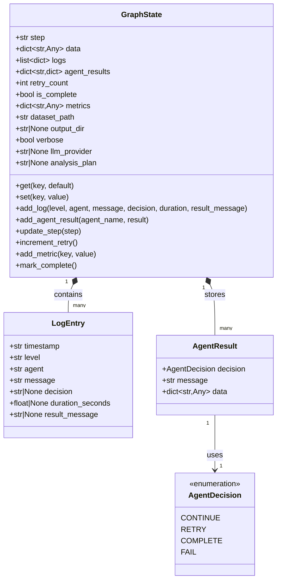
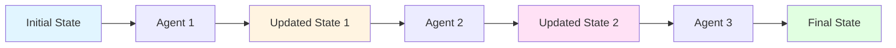

# DataForge AI - GraphState Model



## GraphState Fields

### Core Fields

| Field | Type | Description | Example |
|-------|------|-------------|---------|
| `step` | `str` | Current workflow step | `"planning"` |
| `data` | `dict[str, Any]` | Agent data storage | `{"df": DataFrame, "stats": {...}}` |
| `logs` | `list[dict]` | Execution logs | `[{"timestamp": "...", "level": "INFO", ...}]` |
| `agent_results` | `dict[str, dict]` | Agent outputs | `{"planner": {"plan": "..."}}` |
| `retry_count` | `int` | Current retry count | `0` |
| `is_complete` | `bool` | Workflow completion flag | `false` |
| `metrics` | `dict[str, Any]` | Performance metrics | `{"duration": 5.2, "rows": 100}` |

### Configuration Fields

| Field | Type | Description | Example |
|-------|------|-------------|---------|
| `dataset_path` | `str` | Path to input CSV | `"datasets/employees.csv"` |
| `output_dir` | `str \| None` | Output directory path | `"output/employees"` |
| `verbose` | `bool` | Verbose logging flag | `true` |
| `llm_provider` | `str \| None` | LLM provider name | `"openai"` |
| `analysis_plan` | `str \| None` | Generated analysis plan | `"Analyze salary distribution..."` |

### Data Dictionary (stored in `data` field)

| Key | Type | Description | Set By |
|-----|------|-------------|--------|
| `df` | `pd.DataFrame` | Loaded dataset | DataIngestionAgent |
| `schema` | `dict` | Column schema info | DataProfilingAgent |
| `types` | `dict` | Column type mapping | DataProfilingAgent |
| `stats` | `dict` | Descriptive statistics | StatisticalAnalysisAgent |
| `visualizations` | `list` | Generated chart paths | VisualizationAgent |
| `report_path` | `str` | HTML report path | ReportingAgent |
| `json_path` | `str` | JSON report path | ReportingAgent |

## State Mutation Pattern



### Key Principles

1. **Immutable Updates**: Each state update returns a new GraphState instance
2. **Single Source of Truth**: All agents read/write through the same state object
3. **Structured Logging**: All actions are logged via `add_log()`
4. **Type Safety**: Pydantic validates all state fields
5. **Observability**: Complete audit trail via logs and metrics

### State Lifecycle

```python
# 1. Initial State
state = GraphState(
    dataset_path="datasets/employees.csv",
    output_dir="output/employees",
    verbose=True
)

# 2. Agent Updates State
result, new_state = await agent.execute_with_logging(state)
# new_state has updated step, logs, data, etc.

# 3. Next Agent Uses Updated State
result, final_state = await next_agent.execute_with_logging(new_state)

# 4. Mark Complete
complete_state = final_state.mark_complete()
```

## Agent Decision Flow

```mermaid
graph TB
    START[Agent Execute] --> PROCESS[Process Task]
    PROCESS --> SUCCESS{Success?}

    SUCCESS -->|Yes| DECISION[Make Decision]
    SUCCESS -->|No| ERROR[Handle Error]

    DECISION --> CONTINUE{Continue?}
    DECISION --> RETRY{Retry?}
    DECISION --> COMPLETE{Complete?}
    DECISION --> FAIL{Fail?}

    CONTINUE -->|Yes| LOG_CONTINUE[Log: CONTINUE]
    RETRY -->|Yes| LOG_RETRY[Log: RETRY]
    COMPLETE -->|Yes| LOG_COMPLETE[Log: COMPLETE]
    FAIL -->|Yes| LOG_FAIL[Log: FAIL]

    ERROR --> ERROR_DECISION{Error Type?}
    ERROR_DECISION -->|Recoverable| RETRY
    ERROR_DECISION -->|Critical| FAIL

    LOG_CONTINUE --> RETURN[Return AgentResult]
    LOG_RETRY --> RETURN
    LOG_COMPLETE --> RETURN
    LOG_FAIL --> RETURN