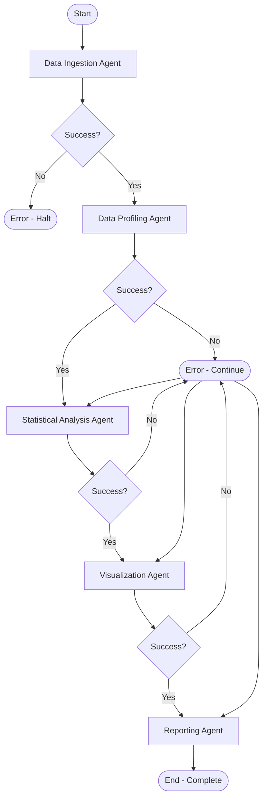

# DataForge AI - Graph Design Document

## Graph Engineering Overview

This document defines the complete LangGraph workflow for DataForge AI. The graph orchestrates autonomous multi-agent analysis of structured datasets.

---

## Graph Architecture

### High-Level Graph Structure

```
┌─────────────────────────────────────────────────────────────────┐
│                         START                                    │
│                    (User Input Received)                         │
└──────────────────────────┬──────────────────────────────────────┘
                           │
                           ▼
┌─────────────────────────────────────────────────────────────────┐
│              Data Ingestion Agent                               │
│  - Read and validate file                                       │
│  - Parse into DataFrame                                         │
│  - Handle encoding issues                                       │
└──────────────────────────┬──────────────────────────────────────┘
                           │
                           ▼
              ┌─────────────────────┐
              │  Ingestion Success? │
              └─────────┬───────────┘
                        │
            ┌───────────┴───────────┐
            │ No                    │ Yes
            ▼                       ▼
    ┌──────────────┐    ┌──────────────────────────────────────┐
    │    ERROR     │    │     Data Profiling Agent             │
    │   (Halt)     │    │  - Identify data types                │
    └──────────────┘    │  - Calculate missing values           │
                        │  - Generate profile summary           │
                        └──────────────┬───────────────────────┘
                                       │
                                       ▼
                          ┌─────────────────────┐
                          │  Profiling Success? │
                          └─────────┬───────────┘
                                    │
                    ┌───────────────┴───────────────┐
                    │ No                            │ Yes
                    ▼                               ▼
            ┌──────────────┐    ┌──────────────────────────────────────┐
            │    ERROR     │    │   Statistical Analysis Agent         │
            │   (Halt)     │    │  - Descriptive statistics            │
            └──────────────┘    │  - Correlations                      │
                                │  - Outlier detection                 │
                                │  - Significance tests                │
                                └──────────────┬───────────────────────┘
                                               │
                                               ▼
                                  ┌─────────────────────┐
                                  │  Statistics Success?│
                                  └─────────┬───────────┘
                                            │
                            ┌───────────────┴───────────────┐
                            │ No                            │ Yes
                            ▼                               ▼
                    ┌──────────────┐    ┌──────────────────────────────────────┐
                    │    ERROR     │    │      Visualization Agent             │
                    │   (Halt)     │    │  - Generate relevant charts          │
                    └──────────────┘    │  - Choose appropriate types          │
                                        │  - Save as PNG files                 │
                                        └──────────────┬───────────────────────┘
                                                       │
                                                       ▼
                                          ┌─────────────────────┐
                                          │  Viz Generation     │
                                          │     Success?        │
                                          └─────────┬───────────┘
                                                    │
                                    ┌───────────────┴───────────────┐
                                    │ No                            │ Yes
                                    ▼                               ▼
                            ┌──────────────┐    ┌──────────────────────────────────────┐
                            │    ERROR     │    │       Reporting Agent               │
                            │ (Continue)   │    │  - Compile all results              │
                            └──────────────┘    │  - Generate insights                │
                                                │  - Create Markdown report           │
                                                │  - Create HTML report              │
                                                └──────────────┬───────────────────────┘
                                                               │
                                                               ▼
                                                  ┌─────────────────────────┐
                                                  │        END               │
                                                  │  (Return Complete State) │
                                                  └─────────────────────────┘
```

---

## Graph State Definition

### Immutable State Schema

```python
@dataclass(frozen=True)
class GraphState:
    """Immutable state flowing through the graph."""

    # === Input Parameters ===
    dataset_path: str
    user_query: Optional[str] = None
    output_dir: str = "./output"
    llm_provider: str = "openai"

    # === Data (populated incrementally) ===
    raw_data: Optional[pd.DataFrame] = None
    profile: Optional[DatasetProfile] = None
    statistics: Optional[StatisticalSummary] = None
    insights: List[Insight] = field(default_factory=list)
    visualizations: List[Visualization] = field(default_factory=list)

    # === Execution Metadata ===
    current_agent: Optional[str] = None
    completed_agents: List[str] = field(default_factory=list)
    errors: List[AgentError] = field(default_factory=list)
    retry_count: int = 0
    execution_id: str = field(default_factory=lambda: str(uuid.uuid4()))

    # === Timing Information ===
    start_time: float = field(default_factory=time.time)
    end_time: Optional[float] = None
```

### State Transition Rules

1. **Immutability**: Each agent returns a NEW state object
2. **Incremental Population**: Fields populated as analysis progresses
3. **Error Accumulation**: Non-fatal errors collected, fatal errors halt
4. **Agent Tracking**: Completed agents list prevents re-execution

---

## Node Specifications

### Node 1: Data Ingestion Agent

**Purpose**: Read and parse the dataset file into a DataFrame.

**Input State Requirements**:
- `dataset_path`: Must be valid file path
- `dataset_path`: Must exist and be readable

**State Updates**:
- Sets `raw_data` to parsed DataFrame
- Sets `current_agent` to "ingestion"
- Appends "ingestion" to `completed_agents`
- On error: Adds `AgentError` to errors list

**Outputs**:
- Success: `raw_data` populated
- Failure: `errors` contains error details

**Error Handling**:
- FileNotFoundError → Fatal error, halt
- PermissionError → Fatal error, halt
- EmptyDataError → Fatal error, halt
- ParseError → Fatal error, halt
- EncodingError → Retry with alternate encoding (max 3)

**Retry Strategy**:
- Encoding errors: retry with UTF-8 → Latin-1 → CP1252
- Max 3 retries
- Backoff: none (immediate retry)

---

### Node 2: Data Profiling Agent

**Purpose**: Analyze data structure, types, and basic statistics.

**Input State Requirements**:
- `raw_data`: Must be non-None DataFrame

**State Updates**:
- Sets `profile` to `DatasetProfile` object
- Sets `current_agent` to "profiling"
- Appends "profiling" to `completed_agents`
- May add initial `insights` to list

**Outputs**:
- Success: `profile` populated with:
  - Column names and types
  - Row/column counts
  - Missing value percentages
  - Unique value counts
  - Potential key columns
- Failure: Error in errors, continue to next agent

**Error Handling**:
- All errors are non-fatal
- Profile generation continues with available data
- Errors logged and state continues

**LLM Usage**:
- Calls LLM to interpret patterns in data
- Generates initial insights about data characteristics
- Uses gpt-3.5-turbo for cost efficiency

---

### Node 3: Statistical Analysis Agent

**Purpose**: Compute descriptive statistics, correlations, and relationships.

**Input State Requirements**:
- `raw_data`: Must be non-None DataFrame
- `profile`: Must be non-None (uses type information)

**State Updates**:
- Sets `statistics` to `StatisticalSummary` object
- Sets `current_agent` to "statistics"
- Appends "statistics" to `completed_agents`
- Extends `insights` list with statistical findings

**Outputs**:
- Success: `statistics` populated with:
  - Descriptive stats (mean, median, std, quartiles)
  - Correlation matrix
  - Significant correlations (p < 0.05)
  - Outlier information
  - Distribution characteristics
- Failure: Partial results if possible

**Error Handling**:
- Non-fatal errors: continue with available columns
- Fatal errors: only if no numeric columns exist

**LLM Usage**:
- Uses GPT-4 for complex interpretation
- Explains statistical findings in natural language
- Identifies interesting patterns and anomalies

**Retry Strategy**:
- LLM API failures: exponential backoff (1s, 2s, 4s)
- Max 3 retries

---

### Node 4: Visualization Agent

**Purpose**: Generate relevant visualizations based on data and findings.

**Input State Requirements**:
- `raw_data`: Must be non-None DataFrame
- `profile`: Must be non-None (uses type information)
- `statistics`: Optional, but used for smart chart selection

**State Updates**:
- Extends `visualizations` list
- Sets `current_agent` to "visualization"
- Appends "visualization" to `completed_agents`

**Outputs**:
- Success: `visualizations` contains:
  - Histograms for numeric distributions
  - Bar charts for categorical distributions
  - Scatter plots for correlated numeric pairs
  - Correlation heatmap
  - Box plots for outliers
  - Time series plots (if temporal data detected)
- Failure: Error logged, no visualizations added

**Chart Selection Logic**:
```python
def select_visualizations(profile: DatasetProfile, stats: StatisticalSummary) -> List[ChartType]:
    """Select appropriate chart types based on data."""
    charts = []

    # Always add distribution charts
    for col in profile.numeric_columns:
        charts.append(ChartType.HISTOGRAM)

    # Correlation heatmap if 2+ numeric columns
    if len(profile.numeric_columns) >= 2:
        charts.append(ChartType.HEATMAP)

    # Scatter plots for strong correlations
    for (col1, col2), corr in stats.correlations.items():
        if abs(corr) > 0.7:
            charts.append(ChartType.SCATTER)

    # Box plots if outliers detected
    if stats.outliers:
        charts.append(ChartType.BOX_PLOT)

    return charts[:6]  # Max 6 visualizations
```

**Error Handling**:
- Non-fatal: individual chart failures don't stop others
- Fatal: only if Plotly entirely unavailable

**No Retry Strategy**: Visualization failures are typically not transient

---

### Node 5: Reporting Agent

**Purpose**: Compile all results into comprehensive reports.

**Input State Requirements**:
- `profile`: Should be non-None
- `statistics`: Should be non-None
- `visualizations`: May be empty
- `insights`: May be empty

**State Updates**:
- Sets `end_time` to current time
- Sets `current_agent` to "reporting"
- Appends "reporting" to `completed_agents`

**Outputs**:
- Success: Creates files in `output_dir`:
  - `report.md`: Markdown report
  - `report.html`: HTML report
  - `visualizations/`: Directory with PNG files
- Returns final state with all results

**Report Structure**:
```markdown
# DataForge Analysis Report

## Dataset Overview
- File: {dataset_path}
- Rows: {n_rows}
- Columns: {n_columns}
- Analysis Date: {date}

## Data Profile
{profile summary}

## Statistical Findings
{statistics summary}

## Key Insights
{insights list}

## Visualizations
{embedded images}

## Methodology
{explanation of methods used}

## Limitations
{known limitations}
```

**LLM Usage**:
- Uses Claude-3 Sonnet for report generation
- Synthesizes insights into narrative
- Ensures clear, professional language

**Error Handling**:
- Non-fatal: partial reports created if possible
- Always attempt to create some output

---

## Edge Routing Logic

### Conditional Routing Function

```python
def route_after_agent(state: GraphState, agent_name: str) -> str:
    """Determine next node based on current state."""

    # Check for fatal errors
    for error in state.errors:
        if error.is_fatal:
            return END

    # Check if agent succeeded
    if agent_name not in state.completed_agents:
        return ERROR_HANDLER

    # Route to next agent based on current position
    agent_order = [
        "ingestion",
        "profiling",
        "statistics",
        "visualization",
        "reporting",
    ]

    current_idx = agent_order.index(agent_name)

    if current_idx < len(agent_order) - 1:
        next_agent = agent_order[current_idx + 1]
        return f"agent_{next_agent}"

    return END
```

### Retry Logic

```python
def should_retry(state: GraphState, error: AgentError) -> bool:
    """Determine if an agent should be retried."""

    # Check retry count
    if state.retry_count >= 3:
        return False

    # Only retry specific error types
    retryable_errors = [
        "RateLimitError",
        "TimeoutError",
        "ConnectionError",
        "EncodingError",
    ]

    return error.error_type in retryable_errors
```

---

## Checkpoint Strategy

### Checkpoint Configuration

```python
from langgraph.checkpoint.memory import MemorySaver

checkpointer = MemorySaver()

# Or for persistent checkpoints:
from langgraph.checkpoint.sqlite import SqliteSaver

checkpointer = SqliteSaver.from_conn_string("checkpoints.db")
```

### Checkpoint Points

1. **After each agent completion**: Save full state
2. **Before LLM calls**: Save state for potential retry
3. **On error**: Save state for debugging

### Checkpoint Data

- Complete GraphState
- Execution timestamp
- Agent results
- Error information

---

## Error Recovery

### Error Handler Node

```python
async def error_handler(state: GraphState) -> GraphState:
    """Handle errors and determine recovery strategy."""

    if not state.errors:
        return state

    latest_error = state.errors[-1]

    # Fatal errors: halt workflow
    if latest_error.is_fatal:
        log.error("Fatal error, halting workflow", error=latest_error)
        return GraphState(
            **asdict(state),
            end_time=time.time(),
        )

    # Non-fatal: continue
    log.warning("Non-fatal error, continuing", error=latest_error)
    return state
```

### Recovery Strategies

| Error Type | Strategy | Agent Action |
|------------|----------|--------------|
| File not found | Halt | Display error, exit |
| Permission denied | Halt | Display error, exit |
| Encoding error | Retry | Try alternate encodings |
| LLM rate limit | Retry | Exponential backoff |
| LLM timeout | Retry | Exponential backoff |
| Invalid data | Continue | Skip problematic column |
| Out of memory | Halt | Display error, exit |
| Visualization error | Continue | Skip failed chart |

---

## Graph Execution

### Synchronous Execution

```python
from langgraph.graph import StateGraph

def create_workflow() -> StateGraph:
    """Create the analysis workflow graph."""

    workflow = StateGraph(GraphState)

    # Add nodes
    workflow.add_node("ingestion", data_ingestion_agent)
    workflow.add_node("profiling", data_profiling_agent)
    workflow.add_node("statistics", statistical_analysis_agent)
    workflow.add_node("visualization", visualization_agent)
    workflow.add_node("reporting", reporting_agent)

    # Add edges
    workflow.set_entry_point("ingestion")
    workflow.add_edge("ingestion", "profiling")
    workflow.add_edge("profiling", "statistics")
    workflow.add_edge("statistics", "visualization")
    workflow.add_edge("visualization", "reporting")
    workflow.add_edge("reporting", END)

    # Add conditional edges
    workflow.add_conditional_edges(
        "ingestion",
        lambda s: route_after_agent(s, "ingestion"),
        {
            "agent_profiling": "profiling",
            "error": END,
        }
    )

    return workflow.compile(checkpointer=checkpointer)
```

### Asynchronous Execution

```python
async def analyze_dataset_async(dataset_path: str) -> GraphState:
    """Execute workflow asynchronously."""

    workflow = create_workflow()

    initial_state = GraphState(dataset_path=dataset_path)

    config = {
        "configurable": {"thread_id": "analysis-123"},
    }

    final_state = await workflow.ainvoke(initial_state, config)

    return final_state
```

---

## Graph Visualization

### Mermaid Diagram



### LangGraph Built-in Visualization

```python
from IPython.display import Image, display

# Get graph visualization
img = workflow.get_graph().draw_mermaid_png()
display(Image(img))
```

---

## Performance Considerations

### Parallelization Potential

Future versions could parallelize:
- Multiple visualizations (independent)
- Multiple LLM calls for different insights
- Profile computation for different columns

### Current v1.0 Approach

Sequential execution ensures:
- Simplicity and maintainability
- Clear error handling
- Predictable resource usage
- Easy debugging

---

## Monitoring and Observability

### Logging Points

1. **Graph Start**: Log execution ID and input parameters
2. **Before Each Agent**: Log agent name and state snapshot
3. **After Each Agent**: Log result and duration
4. **On Error**: Log error details and stack trace
5. **Graph End**: Log final state and total duration

### Metrics to Track

- Total execution time
- Per-agent execution time
- LLM API call count and cost
- Memory usage peak
- Error rates by agent
- Retry counts

---

## Testing the Graph

### Unit Tests for Nodes

```python
@pytest.mark.asyncio
async def test_ingestion_agent():
    agent = DataIngestionAgent(file_reader=mock_reader)
    state = GraphState(dataset_path="test.csv")

    result_state = await agent.execute(state)

    assert result_state.raw_data is not None
    assert "ingestion" in result_state.completed_agents
```

### Integration Tests for Workflow

```python
@pytest.mark.asyncio
async def test_complete_workflow():
    workflow = create_workflow()
    initial_state = GraphState(dataset_path="test_data.csv")

    final_state = await workflow.ainvoke(initial_state)

    assert final_state.profile is not None
    assert final_state.statistics is not None
    assert len(final_state.visualizations) > 0
    assert "reporting" in final_state.completed_agents
```

---

## Future Graph Extensions

### Potential New Nodes (v2.0+)

1. **Data Cleaning Agent**: Handle missing values, outliers
2. **Feature Engineering Agent**: Create derived features
3. **ML Modeling Agent**: Train predictive models
4. **Anomaly Detection Agent**: Find unusual patterns
5. **Time Series Analysis Agent**: Seasonality, trends

### Dynamic Agent Selection

```python
def select_agents(profile: DatasetProfile) -> List[str]:
    """Determine which agents to run based on data."""

    agents = ["ingestion", "profiling", "statistics"]

    # Add time series agent if temporal data
    if profile.has_temporal_columns:
        agents.append("time_series_analysis")

    # Add NLP agent if text columns
    if profile.has_text_columns:
        agents.append("text_analysis")

    agents.extend(["visualization", "reporting"])
    return agents
```

---

## Conclusion

This graph design provides a robust, maintainable workflow for autonomous data analysis. The sequential architecture prioritizes simplicity for v1.0 while allowing for future parallelization and dynamic agent selection.

All graph implementation must follow this specification.

**Document Version**: 1.0
**Last Updated**: 2024