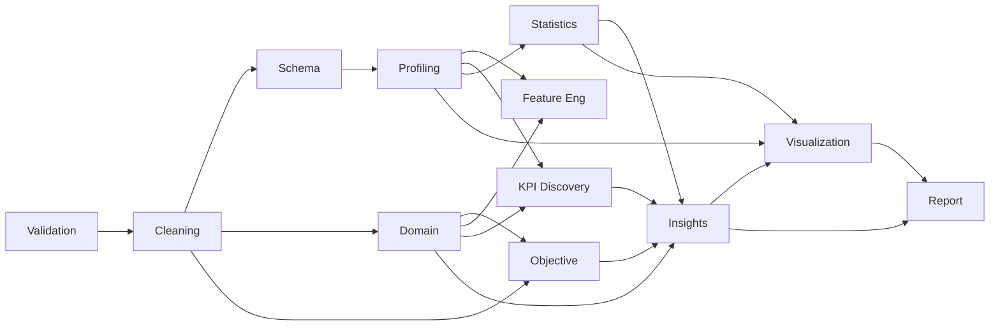

# DataForge AI v2.0 — AGENTS

> 12 Specialized Agents + 1 Planner — The Brain Trust

---

## Design Challenge: The Proposed 16 vs. The Optimal 13

The original proposal listed 16 candidate agents. After critical analysis:

| Proposed Agent | Decision | Rationale |
|---|---|---|
| Planner Agent | ✅ **KEEP** | Central intelligence — irreplaceable |
| Data Validation Agent | ✅ **KEEP** | Separate from Ingestion for SRP |
| Data Cleaning Agent | ✅ **KEEP** | Critical new capability for v2 |
| Schema Detection Agent | ✅ **KEEP** | Foundation for domain/objective detection |
| Business Domain Detection Agent | ✅ **KEEP** | Core v2 differentiator |
| Business Objective Detection Agent | ✅ **KEEP** | Drives KPI discovery |
| Profiling Agent | ✅ **KEEP** | Proven in v1, expanded in v2 |
| Feature Engineering Agent | ✅ **KEEP** | Enables deeper KPI/insight discovery |
| KPI Discovery Agent | ✅ **KEEP** | Core v2 differentiator |
| Statistical Analysis Agent | ✅ **KEEP** | Proven in v1, enhanced in v2 |
| Visualization Planning Agent | ❌ **MERGE** | Merged into VisualizationAgent — separate planning adds latency without proportional value |
| Visualization Agent | ✅ **KEEP** (absorbs planning) | Now includes chart selection logic |
| Insight Generation Agent | ✅ **KEEP** | LLM-powered business insight synthesis |
| Executive Report Agent | ✅ **KEEP** | Expanded from v1 ReportingAgent |
| Evaluator Agent | ❌ **MERGE** | Quality gates integrated into Planner — runs after every agent, not as a standalone step |
| Memory / Audit Agent | ❌ **REMOVE** | Audit trail is a cross-cutting concern of GraphState and BaseAgent, not an agent |

### Final Agent Count: 13 (1 Planner + 12 Specialized)

---

## Agent Architecture

### BaseAgent Contract

Every agent extends `BaseAgent` and implements this contract:

```
┌──────────────────────────────────────────────┐
│                  BaseAgent                    │
├──────────────────────────────────────────────┤
│ Properties:                                   │
│   name: str                                   │
│   description: str                            │
│   phase: ExecutionPhase                       │
│   required_inputs: list[str]                  │
│   produced_outputs: list[str]                 │
│   retry_policy: RetryPolicy                   │
│   failure_policy: FailurePolicy               │
│   timeout_seconds: int                        │
├──────────────────────────────────────────────┤
│ Methods:                                      │
│   execute(state) → AgentResult               │
│   can_execute(state) → bool                   │
│   execute_with_logging(state) → (AgentResult, │
│                                  GraphState)  │
│   validate_preconditions(state) → bool        │
└──────────────────────────────────────────────┘
```

### AgentResult Contract

```
┌──────────────────────────────────────┐
│             AgentResult              │
├──────────────────────────────────────┤
│ decision: AgentDecision              │
│   → CONTINUE | SKIP | RETRY | ERROR │
│ message: str                         │
│ data_updates: dict[str, Any]         │
│ metadata: dict[str, Any]             │
│ quality_score: float (0.0 - 1.0)    │
│ execution_notes: list[str]           │
└──────────────────────────────────────┘
```

---

## Agent Specifications

### 1. PlannerAgent — 🧠 The Brain

**Role:** Central decision engine. Runs after every agent. Decides what happens next.

**NOT a processing agent.** The Planner never touches data. It only reads state metadata and makes routing decisions.

| Property | Value |
|---|---|
| Phase | All phases |
| Inputs | `steps_completed`, `agent_history`, `data.*` (metadata only) |
| Outputs | Routing decision (no state updates) |
| LLM Usage | Optional — rule-based fallback available |

**Decision Algorithm:**
1. Check current phase and completed steps
2. Validate last agent's output (quality gate)
3. If validation fails → decide: retry or skip
4. If phase complete → advance to next phase
5. If all phases complete → route to END
6. Check for parallelizable agents in current phase

**v2 Improvement over v1:** The hardcoded `if/elif` chain is replaced with a phase-based execution plan. The Planner maintains an ordered list of phases and tracks progress through them.

---

### 2. DataValidationAgent — 🔍 The Gatekeeper

**Role:** First line of defense. Validates the input file before any processing.

| Property | Value |
|---|---|
| Phase | 1 — Data Intake |
| Inputs | `input_dataset_path` |
| Outputs | `raw_data`, `file_metadata`, `validation_report` |
| Retry | 1 (file issues are usually non-transient) |
| Failure | **HALT** (bad input = no analysis) |
| Timeout | 30s |
| LLM | No |

**Responsibilities:**
- Validate file exists, is readable, and has a supported extension
- Detect file format (CSV, Excel, Parquet, JSON)
- Load data with encoding fallback (UTF-8 → Latin-1 → CP1252)
- Validate structure: non-empty, has columns, consistent row lengths
- Enforce limits: max_file_size_mb, max_rows, max_columns
- Produce `file_metadata`: row count, column count, file size, format, encoding used

**v1 Equivalent:** `DataIngestionAgent` (renamed and expanded)

---

### 3. DataCleaningAgent — 🧹 The Janitor

**Role:** Automatically detect and fix data quality issues. Every decision is explained and logged.

| Property | Value |
|---|---|
| Phase | 2 — Data Preparation |
| Inputs | `raw_data` |
| Outputs | `cleaned_data`, `cleaning_report`, `cleaning_decisions` |
| Retry | 2 |
| Failure | **HALT** (dirty data = unreliable analysis) |
| Timeout | 60s |
| LLM | Optional (for explaining decisions in natural language) |

**Cleaning Operations:**

| Issue | Detection Method | Action |
|---|---|---|
| Missing values | `df.isnull()` percentage per column | Drop column (>70% missing), impute (median/mode), or flag |
| Duplicates | `df.duplicated()` | Remove, log count |
| Invalid dates | `pd.to_datetime(errors='coerce')` | Coerce or flag |
| Incorrect types | Heuristic type inference | Cast with coercion |
| Outliers | IQR method (1.5 × IQR) | Flag, don't remove (leave for analyst) |
| Impossible values | Domain rules (e.g., negative age) | Flag or clip |
| Currency symbols | Regex detection (`$`, `€`, `£`) | Strip, convert to float |
| Encoding issues | Character detection | Re-encode |
| Column naming | Whitespace, special chars | Normalize to snake_case |
| Mixed formats | Pattern detection per column | Standardize |

**Cleaning Report Structure:**
```json
{
  "total_issues_found": 23,
  "total_issues_fixed": 20,
  "rows_before": 1000,
  "rows_after": 985,
  "columns_before": 12,
  "columns_after": 11,
  "decisions": [
    {
      "issue": "Column 'revenue' has 3% missing values",
      "action": "Imputed with median (45,230.00)",
      "rationale": "Low missing rate, numeric column, median is robust to outliers",
      "rows_affected": 30
    }
  ]
}
```

**v1 Equivalent:** None — entirely new agent.

---

### 4. SchemaDetectionAgent — 📐 The Cartographer

**Role:** Deep understanding of column types, relationships, and data structure beyond simple dtypes.

| Property | Value |
|---|---|
| Phase | 3 — Data Understanding |
| Inputs | `cleaned_data` |
| Outputs | `schema_info` |
| Retry | 2 |
| Failure | SKIP (profiling can proceed without it) |
| Timeout | 30s |
| LLM | Optional (for semantic type inference) |

**Detects:**
- **Semantic types:** email, phone, URL, currency, percentage, ID, name, address, date, category, free text
- **Primary key candidates:** unique, non-null columns
- **Foreign key candidates:** columns with limited cardinality matching another column's values
- **Hierarchical relationships:** country → state → city
- **Temporal columns:** with granularity detection (daily, monthly, yearly)

**v1 Equivalent:** Partially covered by `DataProfilingAgent.semantic_type_detection` — now a dedicated agent.

---

### 5. BusinessDomainDetectionAgent — 🏢 The Industry Expert

**Role:** Detect the business domain of the dataset (retail, finance, HR, healthcare, etc.)

| Property | Value |
|---|---|
| Phase | 3 — Data Understanding |
| Inputs | `cleaned_data`, `schema_info` |
| Outputs | `business_domain`, `domain_confidence`, `domain_signals` |
| Retry | 2 |
| Failure | SKIP (falls back to "general" domain) |
| Timeout | 30s |
| LLM | **Primary method** (with rule-based fallback) |

**Supported Domains:**

| Domain | Signal Columns |
|---|---|
| Retail / E-Commerce | product, price, quantity, order, SKU, cart |
| Finance / Banking | balance, transaction, interest, account, loan |
| Human Resources | employee, salary, department, hire_date, performance |
| Healthcare | patient, diagnosis, treatment, dosage, ICD |
| Marketing | campaign, impression, click, conversion, CTR |
| SaaS / Technology | user, subscription, churn, MRR, DAU |
| Real Estate | property, listing, sqft, bedrooms, price |
| Education | student, grade, enrollment, course, GPA |
| Logistics / Supply Chain | shipment, warehouse, delivery, route, inventory |
| General | (fallback) |

**Detection Algorithm:**
1. **Column name matching:** Check column names against domain keyword dictionaries
2. **Value pattern matching:** Check sample values for domain-specific patterns
3. **LLM classification:** Send column names + sample values to LLM for domain classification
4. **Confidence scoring:** Aggregate signals, return domain with highest confidence

**v1 Equivalent:** None — entirely new agent.

---

### 6. BusinessObjectiveDetectionAgent — 🎯 The Strategist

**Role:** Determine what business questions this dataset can answer.

| Property | Value |
|---|---|
| Phase | 3 — Data Understanding |
| Inputs | `cleaned_data`, `business_domain` |
| Outputs | `business_objectives`, `answerable_questions` |
| Retry | 2 |
| Failure | SKIP (analysis proceeds without business framing) |
| Timeout | 30s |
| LLM | **Primary method** |

**Example Outputs:**
- For **HR data**: "Employee retention analysis", "Salary equity audit", "Department performance comparison"
- For **Retail data**: "Product performance ranking", "Revenue trend analysis", "Customer segmentation"
- For **Finance data**: "Transaction anomaly detection", "Portfolio risk assessment", "Cash flow forecasting"

**v1 Equivalent:** None — entirely new agent.

---

### 7. ProfilingAgent — 📊 The Analyst

**Role:** Deep statistical profiling of every column.

| Property | Value |
|---|---|
| Phase | 4 — Deep Analysis |
| Inputs | `cleaned_data` |
| Outputs | `profile` |
| Retry | 2 |
| Failure | SKIP (with degraded reporting) |
| Timeout | 60s |
| LLM | No |

**Per-Column Profile:**
- Type (numeric, categorical, temporal, boolean, text)
- Cardinality (unique count, unique ratio)
- Completeness (missing count, missing ratio)
- Distribution (mean, median, std, skewness, kurtosis for numeric)
- Top values (for categorical)
- Range (min, max, IQR for numeric)
- Outlier count (IQR method)
- Temporal pattern (for date columns: granularity, range, gaps)

**Dataset-Level Profile:**
- Correlation matrix (Pearson, Spearman)
- Significant correlations (|r| > 0.5 with p-value)
- Overall missing ratio
- Duplicate row count

**v1 Equivalent:** `DataProfilingAgent` — enhanced with temporal patterns and correlation significance.

---

### 8. FeatureEngineeringAgent — ⚙️ The Engineer

**Role:** Create derived features that enable deeper analysis.

| Property | Value |
|---|---|
| Phase | 4 — Deep Analysis |
| Inputs | `cleaned_data`, `profile`, `business_domain` |
| Outputs | `engineered_data`, `new_features` |
| Retry | 2 |
| Failure | SKIP (analysis proceeds with original features) |
| Timeout | 60s |
| LLM | Optional (for domain-specific feature suggestions) |

**Feature Types:**

| Type | Example | When |
|---|---|---|
| Temporal extraction | `order_date` → `order_month`, `order_day_of_week`, `order_quarter` | Temporal column detected |
| Ratios | `revenue / quantity` → `unit_price` | Two related numeric columns |
| Binning | `age` → `age_group` (18-25, 26-35, ...) | Numeric column with wide range |
| Aggregation flags | `is_high_value_customer` | Business domain suggests it |
| Interaction | `price * quantity` → `total_value` | Related columns in same domain |

**v1 Equivalent:** None — entirely new agent.

---

### 9. KPIDiscoveryAgent — 📈 The Scorekeeper

**Role:** Discover domain-specific Key Performance Indicators.

| Property | Value |
|---|---|
| Phase | 4 — Deep Analysis |
| Inputs | `cleaned_data`, `profile`, `business_domain` |
| Outputs | `discovered_kpis` |
| Retry | 2 |
| Failure | SKIP |
| Timeout | 30s |
| LLM | **Primary method** (with rule-based domain templates as fallback) |

**KPI Templates by Domain:**

| Domain | Example KPIs |
|---|---|
| Retail | Revenue, AOV, units sold, return rate, top products, bottom products |
| HR | Avg salary, turnover rate, headcount by dept, salary range, avg tenure |
| Finance | Total transactions, avg balance, default rate, top accounts |
| SaaS | MRR, churn rate, DAU/MAU ratio, ARPU, LTV |
| Marketing | CTR, conversion rate, CPA, ROAS, campaign ROI |

**KPI Structure:**
```json
{
  "name": "Average Order Value",
  "abbreviation": "AOV",
  "formula": "total_revenue / order_count",
  "value": 67.43,
  "trend": "up 12% MoM",
  "benchmark_context": "Industry average: $55-75",
  "business_interpretation": "Customers are spending more per order, likely driven by bundle promotions"
}
```

**v1 Equivalent:** None — entirely new agent.

---

### 10. StatisticalAnalysisAgent — 🔢 The Mathematician

**Role:** Rigorous statistical analysis: hypothesis tests, trends, outlier analysis.

| Property | Value |
|---|---|
| Phase | 5 — Statistical Analysis |
| Inputs | `cleaned_data`, `profile` |
| Outputs | `statistics` |
| Retry | 2 |
| Failure | SKIP |
| Timeout | 60s |
| LLM | No |

**Analyses Performed:**
- Descriptive statistics (mean, median, std, skewness, kurtosis)
- Correlation analysis (Pearson + Spearman with p-values)
- Outlier detection (IQR + Z-score methods)
- Distribution tests (Shapiro-Wilk normality test with n ≥ 8 guard)
- Trend analysis (for temporal data: linear regression on time)
- Group comparisons (for categorical × numeric: ANOVA / Kruskal-Wallis)
- Variance analysis (coefficient of variation)

**v1 Enhancement:** Added p-values, temporal trend analysis, group comparisons, and configurable thresholds.

---

### 11. InsightGenerationAgent — 💡 The Storyteller

**Role:** Synthesize all prior analysis into business-grade insights.

| Property | Value |
|---|---|
| Phase | 6 — Synthesis |
| Inputs | `profile`, `statistics`, `discovered_kpis`, `business_domain`, `business_objectives` |
| Outputs | `business_insights` |
| Retry | 2 |
| Failure | SKIP (report generated without narrative) |
| Timeout | 45s |
| LLM | **Primary method** (critical for natural language synthesis) |

**Insight Categories:**

| Category | Example |
|---|---|
| Top Performers | "Product X generates 34% of total revenue" |
| Bottom Performers | "Region Y underperforms average by 2.3 standard deviations" |
| Trends | "Revenue grew 12% month-over-month in Q3" |
| Anomalies | "Unusual spike in returns during Week 42" |
| Risks | "Customer churn rate exceeds industry benchmark by 40%" |
| Opportunities | "Untapped market: 0 sales in Southeast region despite demand signals" |
| Correlations | "Strong correlation between training hours and performance rating (r=0.78)" |
| Recommendations | "Consider expanding product line X — highest margin at lowest return rate" |

**Insight Structure:**
```json
{
  "category": "top_performers",
  "title": "Product X Dominates Revenue",
  "summary": "Product X generates 34% of total revenue despite being only 8% of SKU count",
  "supporting_data": { "product": "X", "revenue_share": 0.34, "sku_share": 0.08 },
  "severity": "high",
  "business_action": "Prioritize Product X inventory and marketing budget",
  "confidence": 0.92
}
```

**v1 Equivalent:** Insights were generated inline by `StatisticalAnalysisAgent` — now a dedicated LLM-powered agent.

---

### 12. VisualizationAgent — 📉 The Designer

**Role:** Generate executive-grade interactive charts and dashboards.

| Property | Value |
|---|---|
| Phase | 7 — Output |
| Inputs | `cleaned_data`, `profile`, `statistics`, `business_insights`, `discovered_kpis` |
| Outputs | `visualizations`, `dashboard` |
| Retry | 2 |
| Failure | SKIP |
| Timeout | 90s |
| LLM | Optional (for chart type selection) |

**Chart Selection Logic:**

| Data Pattern | Chart Type |
|---|---|
| Numeric distribution | Histogram + box plot |
| Categorical counts | Bar chart (horizontal for >7 categories) |
| Temporal trend | Line chart with trend line |
| Two numeric columns | Scatter plot with regression |
| Correlation matrix | Heatmap |
| KPI values | KPI card grid |
| Composition | Pie chart (≤6 slices) or stacked bar |
| Comparison | Grouped bar chart |
| Geographic (if detected) | Choropleth map |

**Dashboard Layout:**
1. KPI cards row (top)
2. Primary trend chart (large)
3. Distribution charts (2-column grid)
4. Correlation heatmap
5. Top/Bottom performers table

**v1 Enhancement:** Dashboard layout, KPI cards, chart type intelligence, executive styling.

---

### 13. ExecutiveReportAgent — 📄 The Writer

**Role:** Generate polished, executive-ready reports in multiple formats.

| Property | Value |
|---|---|
| Phase | 7 — Output |
| Inputs | All available data from prior agents |
| Outputs | `report_html`, `report_pdf`, `report_json`, `execution_trace` |
| Retry | 1 |
| Failure | SKIP (but this should never fail) |
| Timeout | 120s |
| LLM | **Primary method** (for executive summary narrative) |

**Report Sections:**

| Section | Content |
|---|---|
| Executive Summary | 3-5 sentence business overview (LLM-generated) |
| Key Metrics | KPI cards with values and trends |
| Data Quality | Cleaning report summary |
| Business Domain | Detected domain and confidence |
| Key Findings | Top 5-10 business insights |
| Trends & Patterns | Temporal analysis, MoM/YoY where applicable |
| Top Performers | Best products/regions/employees/etc. |
| Bottom Performers | Underperforming segments |
| Risks & Warnings | Business risks and data quality warnings |
| Recommendations | Actionable business recommendations |
| Statistical Appendix | Detailed statistics for technical readers |
| Methodology | What agents ran, what was skipped, and why |
| Execution Trace | Complete audit trail |

**Report Quality Standard:** Reports must look like they were prepared by a Senior Business Analyst at a consulting firm — not like a Jupyter notebook output.

**Output Formats:**
- **HTML** — Interactive, with embedded Plotly charts, styled with modern CSS
- **PDF** — Print-ready, professional formatting (via WeasyPrint/Playwright)
- **JSON** — Machine-readable, for API consumers

**v1 Enhancement:** Jinja2 templates, PDF generation, LLM narrative, executive framing.

---

## Agent Dependency Graph



---

## Agent Communication

Agents do NOT communicate directly. All communication happens through `GraphState`:

1. Agent A writes to `state.data["key_x"]`
2. Planner routes to Agent B
3. Agent B reads from `state.data["key_x"]`

This ensures:
- No coupling between agents
- Full auditability (state is the single source of truth)
- Easy testing (mock state, call agent, assert result)
