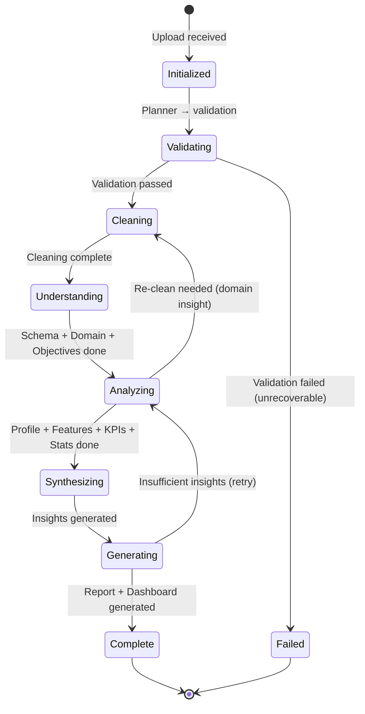

# DataForge AI v2.0 — GRAPH DESIGN

> The Intelligent Routing Engine — A True Graph, Not a Pipeline

---

## 1. Design Philosophy

The graph is the **brain** of DataForge AI. It is NOT a linear pipeline. It is a dynamic, conditional, self-healing execution engine where:

- The **Planner** runs after every agent and decides what happens next
- Agents can be **skipped** (e.g., statistics for non-numeric data)
- Agents can be **repeated** (e.g., re-clean after domain detection reveals semantic meaning)
- The system **heals** from errors by retrying or degrading gracefully
- **Parallel branches** execute independent agents concurrently

---

## 2. Graph Topology

```mermaid
graph TD
    START([START]) --> PLANNER

    PLANNER{{"🧠 PLANNER<br/>Central Decision Engine"}}

    PLANNER -->|"validate"| VALIDATION["🔍 Data Validation"]
    PLANNER -->|"clean"| CLEANING["🧹 Data Cleaning"]
    PLANNER -->|"schema"| SCHEMA["📐 Schema Detection"]
    PLANNER -->|"domain"| DOMAIN["🏢 Domain Detection"]
    PLANNER -->|"objective"| OBJECTIVE["🎯 Objective Detection"]
    PLANNER -->|"profile"| PROFILING["📊 Profiling"]
    PLANNER -->|"engineer"| FEATURE_ENG["⚙️ Feature Engineering"]
    PLANNER -->|"kpi"| KPI["📈 KPI Discovery"]
    PLANNER -->|"statistics"| STATISTICS["🔢 Statistical Analysis"]
    PLANNER -->|"insights"| INSIGHTS["💡 Insight Generation"]
    PLANNER -->|"visualize"| VISUALIZATION["📉 Visualization"]
    PLANNER -->|"report"| REPORTING["📄 Executive Report"]
    PLANNER -->|"complete"| FINISH([END])

    VALIDATION --> PLANNER
    CLEANING --> PLANNER
    SCHEMA --> PLANNER
    DOMAIN --> PLANNER
    OBJECTIVE --> PLANNER
    PROFILING --> PLANNER
    FEATURE_ENG --> PLANNER
    KPI --> PLANNER
    STATISTICS --> PLANNER
    INSIGHTS --> PLANNER
    VISUALIZATION --> PLANNER
    REPORTING --> PLANNER

    style PLANNER fill:#FF6B6B,stroke:#333,stroke-width:3px,color:#fff
    style FINISH fill:#51CF66,stroke:#333,stroke-width:2px
    style START fill:#339AF0,stroke:#333,stroke-width:2px,color:#fff
```



### Hub-and-Spoke Pattern
Every agent returns to the Planner. The Planner is the **only** node with conditional outgoing edges. This creates a hub-and-spoke topology where:

- The Planner is the **single point of intelligence**
- No agent needs to know what comes next
- The graph is fully dynamic — the Planner decides at runtime

---

## 3. Planner Decision Logic

The Planner maintains an internal **execution plan** — an ordered list of phases. After each agent completes, the Planner:

1. **Validates** the agent's output (quality gate)
2. **Updates** the execution plan based on results
3. **Decides** the next action: continue, skip, retry, or complete

### Execution Phases (Default Order)

```
Phase 1: DATA INTAKE
  └── DataValidationAgent → validates file, format, basic structure

Phase 2: DATA PREPARATION
  └── DataCleaningAgent → missing values, duplicates, type coercion

Phase 3: DATA UNDERSTANDING
  ├── SchemaDetectionAgent → column types, relationships, keys
  ├── BusinessDomainDetectionAgent → retail? finance? HR? healthcare?
  └── BusinessObjectiveDetectionAgent → what business questions can this answer?

Phase 4: DEEP ANALYSIS
  ├── ProfilingAgent → distributions, cardinality, correlations
  ├── FeatureEngineeringAgent → derived columns, ratios, bins
  └── KPIDiscoveryAgent → domain-specific KPIs

Phase 5: STATISTICAL ANALYSIS
  └── StatisticalAnalysisAgent → hypothesis tests, trends, outliers

Phase 6: SYNTHESIS
  └── InsightGenerationAgent → business insights from all prior analysis

Phase 7: OUTPUT
  ├── VisualizationAgent → executive dashboard charts
  └── ExecutiveReportAgent → HTML, PDF, JSON reports
```

### Conditional Routing Rules

| Condition | Action |
|---|---|
| No numeric columns detected | Skip StatisticalAnalysisAgent |
| No temporal columns detected | Skip time-series analysis |
| Domain detection confidence < 50% | Use "general" domain, note in report |
| Cleaning removed > 30% of rows | Flag warning, re-profile |
| Previous agent returned ERROR | Retry (max 3), then skip with degradation |
| All Phase 6 agents complete | Proceed to Phase 7 |
| Phase 7 complete | → END |

---

## 4. Node Specification

Every graph node must define:

| Property | Description |
|---|---|
| `name` | Unique node identifier |
| `agent_class` | The agent class to instantiate |
| `inputs` | Required `GraphState` keys (preconditions) |
| `outputs` | `GraphState` keys this agent produces |
| `retry_policy` | Max retries, backoff strategy |
| `failure_policy` | `skip` (degrade) or `halt` (stop workflow) |
| `timeout_seconds` | Maximum execution time |
| `can_parallelize` | Whether this node can run concurrently with others |

### Node Registry

| Node | Inputs | Outputs | Retry | Failure | Timeout | Parallel? |
|---|---|---|---|---|---|---|
| `validation` | `input_dataset_path` | `raw_data`, `file_metadata` | 1 | halt | 30s | No |
| `cleaning` | `raw_data` | `cleaned_data`, `cleaning_report` | 2 | halt | 60s | No |
| `schema` | `cleaned_data` | `schema_info` | 2 | skip | 30s | Yes |
| `domain` | `cleaned_data`, `schema_info` | `business_domain` | 2 | skip | 30s | Yes |
| `objective` | `cleaned_data`, `business_domain` | `business_objectives` | 2 | skip | 30s | Yes |
| `profiling` | `cleaned_data` | `profile` | 2 | skip | 60s | No |
| `feature_eng` | `cleaned_data`, `profile`, `business_domain` | `engineered_data`, `new_features` | 2 | skip | 60s | No |
| `kpi` | `cleaned_data`, `profile`, `business_domain` | `discovered_kpis` | 2 | skip | 30s | No |
| `statistics` | `cleaned_data`, `profile` | `statistics` | 2 | skip | 60s | No |
| `insights` | `profile`, `statistics`, `discovered_kpis`, `business_domain` | `business_insights` | 2 | skip | 45s | No |
| `visualization` | `cleaned_data`, `profile`, `statistics`, `business_insights` | `visualizations`, `dashboard` | 2 | skip | 90s | No |
| `reporting` | `*` (all available data) | `report_html`, `report_pdf`, `report_json` | 1 | skip | 120s | No |

---

## 5. Parallel Execution Windows

Certain agents are independent and can execute concurrently:

### Window 1: Data Understanding (Phase 3)
```
                    ┌── SchemaDetectionAgent ──┐
cleaned_data ───────┤── DomainDetectionAgent ──├──→ Planner
                    └── ObjectiveDetectionAgent┘
```

These three agents read `cleaned_data` and produce independent outputs. They run via `asyncio.gather()`.

### Window 2: Deep Analysis (Phase 4)
```
                    ┌── ProfilingAgent ──────────┐
cleaned_data ───────┤── FeatureEngineeringAgent ─├──→ Planner
                    └── KPIDiscoveryAgent ───────┘
```

> **Note:** Feature Engineering and KPI Discovery depend on `profile`, so they may need to wait for Profiling. The Planner handles this by running Profiling first, then parallelizing Feature Engineering and KPI Discovery.

---

## 6. State Transitions



---

## 7. Loop Detection & Termination

### Step Counter
Every agent execution increments a global step counter. If `step_count > 30`, the Planner forces completion with whatever results are available.

### Agent Visit Counter
Each agent tracks how many times it has been invoked. If `visit_count[agent] > max_retries[agent]`, that agent is permanently skipped.

### Phase Progression
The Planner tracks the current phase (1-7). It can move backward one phase (for re-cleaning) but never more than one. Forward progress is always guaranteed after `max_retries`.

---

## 8. Graph Visualization (Real-Time UI)

The Web UI displays the graph as a visual workflow (similar to n8n, LangGraph Studio, or Prefect):

### Node Display
Each node shows:
| Element | Content |
|---|---|
| Status badge | ⏳ Pending, ▶️ Running, ✅ Complete, ❌ Failed, ⏭️ Skipped |
| Execution time | Duration in seconds |
| Output summary | Key outputs (e.g., "Cleaned 15 rows, removed 2 duplicates") |
| Expand button | Click to see detailed logs and data |

### Edge Display
- Edges light up as the workflow progresses
- Active edge is highlighted with animation
- Conditional edges show the routing decision

### Layout
- Vertical flow (top to bottom)
- Planner at center with radiating spokes
- Collapsed by default, expandable sections

---

## 9. Checkpoint & Recovery

After each agent completes:
1. Serialize `GraphState` to JSON (excluding DataFrames)
2. Save DataFrames to Parquet files
3. Store in `output/{execution_id}/checkpoints/{step_name}/`

On crash recovery:
1. Load latest checkpoint
2. Resume from the Planner node with restored state
3. Skip already-completed agents (check `steps_completed`)

---

## 10. Differences from v1

| Aspect | v1 | v2 |
|---|---|---|
| Number of agents | 7 | 12 (Planner excluded from count) |
| Routing | Hardcoded if/elif in Planner | Phase-based with conditional rules |
| Evaluator | Separate agent, runs once | Integrated into Planner, runs after every agent |
| Parallelism | None | asyncio.gather for independent agents |
| Checkpointing | None | After every agent |
| Loop detection | None | Step counter + visit counter |
| Graph visualization | None | Real-time Web UI |
| Failure handling | Retry 3 times, then END | Retry, skip with degradation, or halt |
| Business awareness | None | Domain detection + objective detection + KPI discovery |
