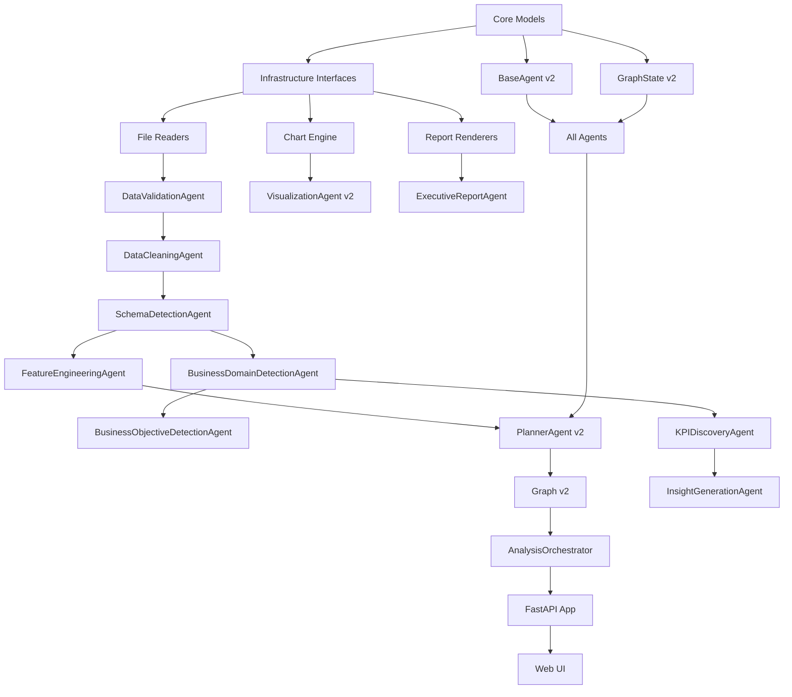

# DataForge AI v1 → v2 Comparison Report

> **Status:** Draft for Review  
> **Generated:** 2026-08-03  
> **Purpose:** Comprehensive comparison between current v1 implementation and frozen v2 architecture

---

## Executive Summary

This report provides a detailed comparison between the current DataForge AI v1 implementation and the frozen v2 architecture. The v2 architecture represents a significant evolution from a 7-agent pipeline to a 13-agent autonomous business intelligence system with clean architecture principles, enhanced state management, and executive-grade output capabilities.

**Key Findings:**
- **5 new agents** need to be created
- **2 agents** need modification (Planner, Ingestion → Validation)
- **1 agent** needs removal (Evaluator - merged into Planner)
- **1 agent** needs significant enhancement (Visualization)
- **3 new architectural layers** need to be added (Application, Domain models, Infrastructure interfaces)
- **Complete restructure** of GraphState required
- **New presentation layer** (FastAPI + Web UI) to be added

---

## 1. What Already Exists (v1 Implementation)

### 1.1 Existing Folder Structure
```
dataforge/
├── __init__.py
├── __main__.py
├── agents/                    # 7 agents
│   ├── __init__.py
│   ├── base.py               # BaseAgent ABC
│   ├── planner.py            # PlannerAgent
│   ├── ingestion.py          # DataIngestionAgent
│   ├── profiling.py          # DataProfilingAgent
│   ├── statistics.py         # StatisticalAnalysisAgent
│   ├── visualization.py      # VisualizationAgent
│   ├── reporting.py          # ReportingAgent
│   └── evaluator.py          # EvaluatorAgent
├── core/                      # Core components
│   ├── __init__.py
│   ├── llm.py                # LLMProvider ABC + LLMConfig
│   ├── logger.py             # StructuredLogger
│   └── state.py              # GraphState (v1)
├── graph/                     # Graph orchestration
│   ├── __init__.py
│   └── workflow.py           # LangGraph StateGraph
├── infrastructure/            # LLM providers only
│   ├── __init__.py
│   └── llm_providers/
│       ├── __init__.py
│       ├── openai.py
│       └── anthropic.py
├── presentation/              # CLI only
│   ├── __init__.py
│   └── cli.py
└── shared/                    # Shared utilities
    ├── __init__.py
    ├── config.py             # Settings
    ├── errors.py             # Custom exceptions
    └── utils.py              # Utilities
```

### 1.2 Existing Components

#### Agents (7 total)
1. **BaseAgent** - Abstract base class with execute(), execute_with_logging()
2. **PlannerAgent** - Hardcoded if/elif routing, 7-step pipeline
3. **DataIngestionAgent** - CSV/Parquet loading with encoding fallback
4. **DataProfilingAgent** - Column analysis, semantic types, basic insights
5. **StatisticalAnalysisAgent** - Descriptive stats, correlations, distribution tests, outliers
6. **VisualizationAgent** - Plotly charts (histograms, box plots, scatter, bar, heatmap)
7. **ReportingAgent** - HTML+JSON report generation (string concatenation)
8. **EvaluatorAgent** - Quality validation (4 checks: has_data, has_insights, data_quality, sufficient_depth)

#### Core Components
- **GraphState** - Pydantic model with data dict, execution tracking, retry logic
- **LLMProvider** - Abstract interface with retry logic
- **StructuredLogger** - Colored console + JSON file logging
- **Settings** - Pydantic settings from environment

#### Graph
- **StateGraph** - LangGraph v0.0.20 implementation
- **Hub-and-spoke** topology (all agents return to Planner)
- **Linear routing** via hardcoded if/elif chains

#### Infrastructure
- **OpenAIProvider** - OpenAI API implementation
- **AnthropicProvider** - Anthropic API implementation

#### Presentation
- **CLI** - Click-based command-line interface only

### 1.3 Existing Dependencies (pyproject.toml)
```toml
[tool.poetry.dependencies]
python = "^3.11"
pandas = "^2.0.0"
numpy = "^1.24.0"
scipy = "^1.11.0"
plotly = "^5.18.0"
pyarrow = "^12.0.0"
kaleido = "^0.2.1"
langgraph = "^0.0.20"          # PRE-STABLE
openai = "^1.0.0"
anthropic = "^0.7.0"
pydantic = "^2.0.0"
click = "^8.1.0"
structlog = "^23.0.0"
python-dotenv = "^1.0.0"
markdown = "^3.5.0"
```

---

## 2. What Needs Modification

### 2.1 GraphState (Complete Restructure)

**Current v1 Structure:**
```python
class GraphState(BaseModel):
    input_dataset_path: str
    input_query: str | None
    output_dir: str
    data: dict[str, Any]
    execution_id: str
    current_step: str
    steps_completed: list[str]
    agent_history: list[dict[str, Any]]
    validation_status: str
    validation_errors: list[str]
    retry_count: int
    max_retries: int
    logs: list[dict[str, Any]]
    metrics: dict[str, Any]
    start_time: str
    end_time: str | None
```

**Required v2 Changes:**
```python
class GraphState(BaseModel):
    # IMMUTABLE INPUT
    input_dataset_path: str
    input_query: str | None
    output_dir: str
    execution_id: str
    start_time: str
    
    # MUTABLE DATA
    data: dict[str, Any]  # Well-known keys documented
    
    # EXECUTION TRACKING
    current_phase: int  # NEW: 1-7 phases
    current_step: str
    steps_completed: list[str]
    steps_skipped: list[str]  # NEW
    agent_history: list[AgentHistoryEntry]  # NEW: Typed
    
    # QUALITY & RETRY
    agent_visit_count: dict[str, int]  # NEW: Per-agent
    global_step_count: int  # NEW
    max_global_steps: int  # NEW
    quality_warnings: list[str]  # NEW
    quality_errors: list[str]  # NEW
    
    # OBSERVABILITY
    logs: list[LogEntry]  # NEW: Typed
    metrics: dict[str, Any]
    end_time: str | None
    
    # NEW: Typed accessors for well-known keys
    @property def raw_data(self) -> pd.DataFrame | None
    @property def cleaned_data(self) -> pd.DataFrame | None
    @property def business_domain(self) -> BusinessDomain | None
    @property def profile(self) -> DataProfile | None
    # ... more typed accessors
```

**Changes Required:**
- Add `current_phase` (IntEnum 1-7)
- Add `steps_skipped` list
- Add `agent_visit_count` dict (per-agent tracking)
- Add `global_step_count` and `max_global_steps`
- Add `quality_warnings` and `quality_errors` (replace validation_status)
- Remove `validation_status`, `validation_errors`, `retry_count`, `max_retries`
- Add typed `AgentHistoryEntry` and `LogEntry` models
- Add typed accessor properties for all well-known state keys
- Add checkpoint serialization methods

### 2.2 BaseAgent (Enhancement)

**Current v1 Structure:**
```python
class Agent(ABC):
    def __init__(self, llm_provider, logger)
    @abstractmethod async def execute(state) -> AgentResult
    async def execute_with_logging(state) -> (AgentResult, GraphState)
    def can_handle(state) -> bool
    def get_dependencies() -> list[str]
```

**Required v2 Changes:**
```python
class BaseAgent(ABC):
    # NEW: Agent metadata
    name: str
    description: str
    phase: ExecutionPhase  # NEW
    required_inputs: list[str]  # NEW
    produced_outputs: list[str]  # NEW
    retry_policy: RetryPolicy  # NEW
    failure_policy: FailurePolicy  # NEW
    timeout_seconds: int  # NEW
    
    # NEW: Precondition checking
    def can_execute(state) -> bool  # Enhanced
    def validate_preconditions(state) -> bool  # NEW
    
    # Enhanced execute with quality scoring
    @abstractmethod async def execute(state) -> AgentResult
    async def execute_with_logging(state) -> (AgentResult, GraphState)
```

**Changes Required:**
- Add `phase` attribute (ExecutionPhase enum)
- Add `required_inputs` declaration
- Add `produced_outputs` declaration
- Add `retry_policy` (max_retries, backoff_strategy)
- Add `failure_policy` (HALT or SKIP)
- Add `timeout_seconds`
- Add `can_execute()` precondition checking
- Add `quality_score` to AgentResult
- Add `execution_notes` to AgentResult

### 2.3 PlannerAgent (Complete Rewrite)

**Current v1 Behavior:**
- Hardcoded if/elif chains for routing
- 7-step linear pipeline
- Runs after each agent
- Simple state-based decision making

**Required v2 Behavior:**
- Phase-based execution plan (7 phases)
- Per-agent quality gate validation
- Loop detection (step counter + visit counter)
- Parallel agent dispatch (asyncio.gather)
- Dynamic plan adjustment based on data characteristics
- Quality gates integrated (Evaluator removed)

**Changes Required:**
- Complete rewrite of routing logic
- Add phase tracking and progression
- Add quality gate validation after each agent
- Add parallel dispatch logic
- Add loop detection and prevention
- Remove dependency on EvaluatorAgent

### 2.4 DataIngestionAgent → DataValidationAgent (Rename + Expand)

**Current v1 Behavior:**
- CSV/Parquet loading
- Encoding fallback
- Basic DataFrame validation

**Required v2 Behavior:**
- File existence, readability, extension validation
- Format detection (CSV, Excel, Parquet, JSON)
- Encoding detection and fallback
- Size and row count enforcement
- Structure validation
- FileMetadata generation
- ValidationReport generation

**Changes Required:**
- Rename to `DataValidationAgent`
- Add Excel support (openpyxl)
- Add JSON support (records + lines format)
- Add max_file_size_mb enforcement
- Add max_rows enforcement
- Add max_columns enforcement
- Add FileMetadata model
- Add ValidationReport model
- Output `raw_data`, `file_metadata`, `validation_report`

### 2.5 VisualizationAgent (Significant Enhancement)

**Current v1 Behavior:**
- Distribution plots (histograms)
- Box plots
- Correlation heatmap
- Scatter plots for correlations
- Bar charts for categorical
- Categorical vs numeric plots

**Required v2 Behavior:**
- Chart type selection logic (data pattern → chart type)
- Dashboard layout (KPI cards + trend chart + distributions + heatmap)
- KPI card visualization
- Executive styling (colors, fonts, layout)
- Interactive dashboard HTML
- Chart selection intelligence

**Changes Required:**
- Add chart type selection logic
- Add dashboard layout generation
- Add KPI card visualization
- Add executive styling
- Add responsive dashboard HTML
- Use ChartEngine interface (injected dependency)

### 2.6 ReportingAgent → ExecutiveReportAgent (Rename + Enhance)

**Current v1 Behavior:**
- HTML report via string concatenation
- JSON report
- Basic sections: profile, statistics, visualizations, insights

**Required v2 Behavior:**
- Jinja2 templates (report.html, dashboard.html, executive_summary.html)
- PDF generation (WeasyPrint)
- Executive summary (LLM-generated)
- All report sections (key metrics, domain, findings, risks, recommendations, etc.)
- Execution trace inclusion
- Professional formatting

**Changes Required:**
- Rename to `ExecutiveReportAgent`
- Replace string concatenation with Jinja2 templates
- Add PDF generation (WeasyPrint)
- Add executive summary generation (LLM)
- Add all new report sections
- Use ReportRenderer interface (injected dependency)
- Output `report_html`, `report_pdf`, `report_json`, `execution_trace`

### 2.7 LangGraph Upgrade

**Current v1:**
```toml
langgraph = "^0.0.20"  # PRE-STABLE
```

**Required v2:**
```toml
langgraph = "^0.2.0"  # STABLE
```

**Changes Required:**
- Upgrade to stable LangGraph API
- Update to use `StateGraph`, `CompiledGraph`, `MemorySaver`
- Update graph compilation syntax
- Add checkpointing support

---

## 3. What Needs Complete Replacement

### 3.1 New Agents (5 total)

#### 1. DataCleaningAgent (NEW)
**Purpose:** Automatically detect and fix data quality issues with explained decisions

**Responsibilities:**
- Missing value detection and handling
- Duplicate row detection and removal
- Invalid date detection and coercion
- Incorrect type detection and casting
- Outlier flagging (IQR method)
- Currency symbol stripping
- Encoding problem detection
- Column name normalization
- Mixed format detection and standardization
- Cleaning decision logging with explanations
- Cleaning report generation

**Outputs:** `cleaned_data`, `cleaning_report`, `cleaning_decisions`

#### 2. SchemaDetectionAgent (NEW)
**Purpose:** Deep understanding of column types, relationships, and data structure

**Responsibilities:**
- Semantic type detection (email, phone, URL, currency, ID, name, etc.)
- Primary key candidate detection
- Foreign key candidate detection
- Hierarchical relationship detection
- Temporal column detection with granularity

**Outputs:** `schema_info`

#### 3. BusinessDomainDetectionAgent (NEW)
**Purpose:** Detect the business domain of the dataset

**Responsibilities:**
- Column name keyword matching against domain dictionaries
- LLM-based domain classification
- Rule-based fallback
- Confidence scoring
- Support 10 domains (retail, finance, HR, healthcare, marketing, SaaS, real estate, education, logistics, general)

**Outputs:** `business_domain`, `domain_confidence`, `domain_signals`

#### 4. BusinessObjectiveDetectionAgent (NEW)
**Purpose:** Determine what business questions this dataset can answer

**Responsibilities:**
- LLM-powered business question generation
- Domain-aware question templates as fallback

**Outputs:** `business_objectives`, `answerable_questions`

#### 5. FeatureEngineeringAgent (NEW)
**Purpose:** Create derived features that enable deeper analysis

**Responsibilities:**
- Temporal feature extraction (month, day_of_week, quarter)
- Ratio computation
- Binning (age groups, price ranges)
- Aggregation flags
- Interaction features

**Outputs:** `engineered_data`, `new_features`

#### 6. KPIDiscoveryAgent (NEW)
**Purpose:** Discover domain-specific Key Performance Indicators

**Responsibilities:**
- Domain-specific KPI templates
- KPI value computation
- KPI trend calculation (MoM, YoY where temporal data exists)
- Benchmark context

**Outputs:** `discovered_kpis`

#### 7. InsightGenerationAgent (NEW)
**Purpose:** Synthesize all prior analysis into business-grade insights

**Responsibilities:**
- Insight category detection (top/bottom performers, trends, anomalies, risks, opportunities)
- LLM synthesis of business insights
- Insight ranking by business impact
- Confidence scoring
- Actionable recommendation generation

**Outputs:** `business_insights`

### 3.2 New Domain Models (Complete New Layer)

**Location:** `dataforge/core/models.py` (NEW)

**Required Models:**
```python
# AgentResult enhancements
class AgentResult(BaseModel):
    decision: AgentDecision
    message: str
    data_updates: dict[str, Any]
    metadata: dict[str, Any]
    quality_score: float  # NEW
    execution_notes: list[str]  # NEW

# Agent History
class AgentHistoryEntry(BaseModel):
    agent_name: str
    timestamp: str
    duration_seconds: float
    decision: str
    message: str
    quality_score: float | None
    data_keys_produced: list[str]
    metadata: dict[str, Any]

# Log Entry
class LogEntry(BaseModel):
    timestamp: str
    level: str
    agent: str
    message: str
    metadata: dict[str, Any]

# Execution Phase
class ExecutionPhase(IntEnum):
    DATA_INTAKE = 1
    DATA_PREPARATION = 2
    DATA_UNDERSTANDING = 3
    DEEP_ANALYSIS = 4
    STATISTICAL_ANALYSIS = 5
    SYNTHESIS = 6
    OUTPUT = 7

# Retry Policy
class RetryPolicy(BaseModel):
    max_retries: int
    backoff_strategy: str  # "exponential", "linear"
    initial_backoff: float

# Failure Policy
class FailurePolicy(Enum):
    HALT = "halt"
    SKIP = "skip"
```

### 3.3 New Domain Layer (Complete New Layer)

**Location:** `dataforge/core/domain.py` (NEW)

**Required Models:**
```python
# Business Domain
class BusinessDomain(Enum):
    RETAIL = "retail"
    FINANCE = "finance"
    HR = "hr"
    HEALTHCARE = "healthcare"
    MARKETING = "marketing"
    SAAS = "saas"
    REAL_ESTATE = "real_estate"
    EDUCATION = "education"
    LOGISTICS = "logistics"
    GENERAL = "general"

# Domain Registry
class DomainRegistry:
    """Registry of known business domains with signal keywords."""
    
    @staticmethod
    def get_domain_keywords(domain: BusinessDomain) -> list[str]
    @staticmethod
    def classify_from_columns(columns: list[str]) -> BusinessDomain
    @staticmethod
    def classify_from_sample_data(df: pd.DataFrame) -> BusinessDomain

# KPI Definition
class KPI(BaseModel):
    name: str
    abbreviation: str
    formula: str
    value: float
    trend: str | None
    benchmark_context: str | None
    business_interpretation: str

# KPI Templates
class KPITemplates:
    """Domain-specific KPI templates."""
    
    @staticmethod
    def get_kpis_for_domain(domain: BusinessDomain) -> list[KPI]

# Business Insight
class BusinessInsight(BaseModel):
    category: str
    title: str
    summary: str
    supporting_data: dict[str, Any]
    severity: str
    business_action: str
    confidence: float

# Insight Categories
class InsightCategory(Enum):
    TOP_PERFORMERS = "top_performers"
    BOTTOM_PERFORMERS = "bottom_performers"
    TRENDS = "trends"
    ANOMALIES = "anomalies"
    RISKS = "risks"
    OPPORTUNITIES = "opportunities"
    CORRELATIONS = "correlations"
    RECOMMENDATIONS = "recommendations"
```

### 3.4 New Infrastructure Layer (Complete New Layer)

**Location:** `dataforge/infrastructure/` (EXPANDED)

#### File Readers (`dataforge/infrastructure/readers/`)
```python
# FileReader ABC
class FileReader(ABC):
    @abstractmethod
    def read(self, path: Path) -> pd.DataFrame
    @abstractmethod
    def validate_format(self, path: Path) -> bool

# CSVReader
class CSVReader(FileReader):
    def __init__(self, encodings: list[str] = ["utf-8", "latin-1", "cp1252"])
    def read(self, path: Path) -> pd.DataFrame
    def validate_format(self, path: Path) -> bool

# ExcelReader
class ExcelReader(FileReader):
    def read(self, path: Path) -> pd.DataFrame
    def validate_format(self, path: Path) -> bool

# ParquetReader
class ParquetReader(FileReader):
    def read(self, path: Path) -> pd.DataFrame
    def validate_format(self, path: Path) -> bool

# JSONReader
class JSONReader(FileReader):
    def __init__(self, format: str = "records")  # "records" or "lines"
    def read(self, path: Path) -> pd.DataFrame
    def validate_format(self, path: Path) -> bool
```

#### Chart Engine (`dataforge/infrastructure/charts/`)
```python
# ChartEngine ABC
class ChartEngine(ABC):
    @abstractmethod
    def create_bar_chart(...) -> Chart
    @abstractmethod
    def create_line_chart(...) -> Chart
    @abstractmethod
    def create_scatter_plot(...) -> Chart
    @abstractmethod
    def create_histogram(...) -> Chart
    @abstractmethod
    def create_box_plot(...) -> Chart
    @abstractmethod
    def create_heatmap(...) -> Chart
    @abstractmethod
    def create_kpi_card(...) -> Chart

# PlotlyChartEngine
class PlotlyChartEngine(ChartEngine):
    """Plotly implementation of ChartEngine."""
    def create_bar_chart(...) -> Chart
    # ... other methods
```

#### Report Renderers (`dataforge/infrastructure/renderers/`)
```python
# ReportRenderer ABC
class ReportRenderer(ABC):
    @abstractmethod
    def render_html(data: dict) -> str
    @abstractmethod
    def render_pdf(html: str) -> bytes
    @abstractmethod
    def render_json(data: dict) -> str

# HTMLRenderer
class HTMLRenderer(ReportRenderer):
    def __init__(self, template_dir: Path)
    def render_html(data: dict) -> str

# PDFRenderer
class PDFRenderer(ReportRenderer):
    def __init__(self, html_renderer: HTMLRenderer)
    def render_pdf(html: str) -> bytes

# JSONRenderer
class JSONRenderer(ReportRenderer):
    def render_json(data: dict) -> str
```

#### Templates (`dataforge/infrastructure/templates/`)
```
templates/
├── report.html.jinja2
├── dashboard.html.jinja2
└── executive_summary.html.jinja2
```

#### Structured Logger (`dataforge/infrastructure/logging/`)
```python
# Move existing StructuredLogger here
# Add structlog integration
```

### 3.5 New Application Layer (Complete New Layer)

**Location:** `dataforge/application/` (NEW)

```python
# AnalysisOrchestrator
class AnalysisOrchestrator:
    """Coordinates a full analysis run."""
    
    def __init__(self, graph: CompiledStateGraph, session_manager: SessionManager)
    async def analyze(self, state: GraphState) -> GraphState
    async def analyze_with_events(self, state: GraphState, event_bus: EventBus) -> GraphState

# SessionManager
class SessionManager:
    """Manages analysis sessions, tracks progress, stores results."""
    
    def __init__(self, storage_dir: Path)
    def create_session(self, state: GraphState) -> str
    def get_session(self, session_id: str) -> Session | None
    def update_session(self, session_id: str, updates: dict) -> None
    def list_sessions(self) -> list[Session]

# EventBus
class EventBus:
    """Publishes agent completion events for real-time UI updates."""
    
    def __init__(self)
    async def publish(self, event: AgentEvent) -> None
    async def subscribe(self, handler: Callable) -> None
    async def unsubscribe(self, handler: Callable) -> None
```

### 3.6 New Presentation Layer (Complete Replacement)

**Location:** `dataforge/presentation/` (EXPANDED)

#### API (`dataforge/presentation/api/`)
```python
# FastAPI App
class FastAPIApp:
    def __init__(self, orchestrator: AnalysisOrchestrator, session_manager: SessionManager)
    def create_app(self) -> FastAPI

# Routes
# POST /api/analyze (file upload)
# GET /api/status/{execution_id}
# GET /api/results/{execution_id}
# GET /api/download/{execution_id}/{format}

# WebSocket
# /ws/{execution_id} (real-time events)

# Schemas (Pydantic)
class AnalysisRequest(BaseModel)
class AnalysisResponse(BaseModel)
class StatusResponse(BaseModel)
class ResultsResponse(BaseModel)
```

#### Web UI (`dataforge/presentation/web/`)
```html
<!-- index.html -->
<!-- Upload page (drag-and-drop, file validation) -->
```

```javascript
// js/upload.js
// File upload logic
// WebSocket connection
```

```html
<!-- graph.html -->
<!-- Graph visualization (SVG nodes, status badges, animations) -->
```

```javascript
// js/graph.js
// Graph visualization logic
// WebSocket updates
```

```html
<!-- results.html -->
<!-- Results page (report viewer, download buttons) -->
```

```javascript
// js/results.js
// Results display logic
```

### 3.7 New Dependency Injection Container

**Location:** `dataforge/shared/container.py` (NEW)

```python
class DIContainer:
    """Dependency injection container for agent assembly."""
    
    def __init__(self, config: Settings)
    def get_llm_provider(self) -> LLMProvider
    def get_logger(self, execution_id: str) -> StructuredLogger
    def get_chart_engine(self) -> ChartEngine
    def get_report_renderer(self) -> ReportRenderer
    def get_file_reader(self, format: str) -> FileReader
    def create_agent(self, agent_class: type) -> BaseAgent
    def create_all_agents(self) -> dict[str, BaseAgent]
```

---

## 4. What Can Be Reused Without Modification

### 4.1 Core Components (Partial Reuse)

| Component | Reuse Status | Notes |
|-----------|--------------|-------|
| `LLMProvider` ABC | ✅ Full reuse | Interface is stable |
| `LLMConfig` | ✅ Full reuse | May add fields for v2 |
| `LLMResponse` | ✅ Full reuse | Stable structure |
| `LLMProviderFactory` | ✅ Full reuse | Factory pattern works |
| `OpenAIProvider` | ✅ Full reuse | Stable implementation |
| `AnthropicProvider` | ✅ Full reuse | Stable implementation |
| `StructuredLogger` | ⚠️ Partial reuse | Move to infrastructure, add structlog |
| `Settings` | ⚠️ Partial reuse | Add new settings for v2 |

### 4.2 Shared Utilities (Full Reuse)

| Component | Reuse Status | Notes |
|-----------|--------------|-------|
| `errors.py` | ✅ Full reuse | Custom exceptions are stable |
| `utils.py` | ✅ Full reuse | Utility functions are stable |
| `generate_execution_id()` | ✅ Full reuse | UUID generation is stable |
| `get_timestamp()` | ✅ Full reuse | ISO timestamp is stable |

### 4.3 Test Infrastructure (Partial Reuse)

| Component | Reuse Status | Notes |
|-----------|--------------|-------|
| `pytest` configuration | ✅ Full reuse | pytest.ini is stable |
| `conftest.py` | ⚠️ Partial reuse | Add new fixtures for v2 |
| Test patterns | ✅ Full reuse | Test structure is stable |

---

## 5. Every Folder That Will Change

### 5.1 Folders to Modify
```
dataforge/
├── agents/                    # MODIFIED: 5 new agents, 2 modified, 1 removed
│   ├── __init__.py           # Update exports
│   ├── base.py               # MODIFIED: Add phase, retry_policy, etc.
│   ├── planner.py            # MODIFIED: Complete rewrite
│   ├── ingestion.py          # RENAME → validation.py (MODIFIED)
│   ├── profiling.py          # MODIFIED: Add temporal patterns
│   ├── statistics.py         # MODIFIED: Add p-values, temporal trends
│   ├── visualization.py      # MODIFIED: Add dashboard, KPI cards
│   ├── reporting.py          # RENAME → executive_report.py (MODIFIED)
│   ├── evaluator.py          # REMOVED: Merged into Planner
│   ├── validation.py         # NEW: DataValidationAgent
│   ├── cleaning.py           # NEW: DataCleaningAgent
│   ├── schema.py             # NEW: SchemaDetectionAgent
│   ├── domain_detection.py   # NEW: BusinessDomainDetectionAgent
│   ├── objective_detection.py# NEW: BusinessObjectiveDetectionAgent
│   ├── feature_engineering.py# NEW: FeatureEngineeringAgent
│   ├── kpi_discovery.py      # NEW: KPIDiscoveryAgent
│   └── insight_generation.py # NEW: InsightGenerationAgent
│
├── core/                      # MODIFIED: Add new models
│   ├── __init__.py           # Update exports
│   ├── state.py              # MODIFIED: Complete restructure
│   ├── llm.py                # MODIFIED: Add new fields to LLMConfig
│   ├── logger.py             # MOVE → infrastructure/logging/
│   ├── models.py             # NEW: AgentResult, AgentHistoryEntry, etc.
│   ├── domain.py             # NEW: BusinessDomain, KPI, InsightModel
│   ├── insights.py           # NEW: InsightModel, InsightSeverity
│   ├── cleaning.py           # NEW: CleaningRule, CleaningDecision
│   └── interfaces.py         # NEW: FileReader, ChartEngine, ReportRenderer
│
├── graph/                     # MODIFIED: Add checkpointing, new agents
│   ├── __init__.py           # Update exports
│   ├── workflow.py           # MODIFIED: Add 13 agents, checkpointing
│   ├── router.py             # NEW: Routing logic
│   └── checkpointer.py       # NEW: State persistence
│
├── infrastructure/            # MODIFIED: Add new infrastructure
│   ├── __init__.py           # Update exports
│   ├── llm_providers/        # MODIFIED: Add factory
│   │   ├── __init__.py
│   │   ├── openai.py         # ✅ REUSE
│   │   ├── anthropic.py      # ✅ REUSE
│   │   └── factory.py        # NEW: LLMProviderFactory
│   ├── readers/              # NEW: File readers
│   │   ├── __init__.py
│   │   ├── base.py
│   │   ├── csv_reader.py
│   │   ├── excel_reader.py
│   │   ├── parquet_reader.py
│   │   └── json_reader.py
│   ├── charts/               # NEW: Chart engine
│   │   ├── __init__.py
│   │   └── plotly_engine.py
│   ├── renderers/            # NEW: Report renderers
│   │   ├── __init__.py
│   │   ├── html_renderer.py
│   │   ├── pdf_renderer.py
│   │   └── json_renderer.py
│   ├── templates/            # NEW: Jinja2 templates
│   │   ├── report.html.jinja2
│   │   ├── dashboard.html.jinja2
│   │   └── executive_summary.html.jinja2
│   └── logging/              # NEW: Structured logging
│       ├── __init__.py
│       └── structured_logger.py
│
├── presentation/              # MODIFIED: Add API + Web UI
│   ├── __init__.py           # Update exports
│   ├── cli.py                # MODIFIED: Update for v2
│   ├── api/                  # NEW: FastAPI
│   │   ├── __init__.py
│   │   ├── app.py
│   │   ├── routes/
│   │   │   ├── __init__.py
│   │   │   ├── analysis.py
│   │   │   ├── status.py
│   │   │   └── results.py
│   │   ├── schemas.py
│   │   └── websocket.py
│   └── web/                  # NEW: Web UI
│       ├── index.html
│       ├── css/
│       │   └── graph.css
│       └── js/
│           ├── upload.js
│           ├── graph.js
│           └── results.js
│
├── application/               # NEW: Application layer
│   ├── __init__.py
│   ├── orchestrator.py
│   ├── session.py
│   └── events.py
│
└── shared/                    # MODIFIED: Add DI container
    ├── __init__.py           # Update exports
    ├── config.py             # MODIFIED: Add new settings
    ├── errors.py             # ✅ REUSE
    ├── utils.py              # ✅ REUSE
    └── container.py          # NEW: DI container
```

### 5.2 Folders to Create
```
dataforge/
├── core/
│   ├── models.py             # NEW
│   ├── domain.py             # NEW
│   ├── insights.py           # NEW
│   ├── cleaning.py           # NEW
│   └── interfaces.py         # NEW
│
├── infrastructure/
│   ├── readers/              # NEW
│   ├── charts/               # NEW
│   ├── renderers/            # NEW
│   ├── templates/            # NEW
│   └── logging/              # NEW
│
├── presentation/
│   ├── api/                  # NEW
│   │   └── routes/
│   └── web/                  # NEW
│       ├── css/
│       └── js/
│
├── application/              # NEW
└── shared/
    └── container.py          # NEW
```

---

## 6. Every Class That Will Change

### 6.1 Classes to Modify

| Class | File | Changes |
|-------|------|---------|
| `GraphState` | `core/state.py` | Complete restructure: add phases, typed accessors, checkpointing |
| `BaseAgent` | `agents/base.py` | Add phase, retry_policy, failure_policy, timeout_seconds |
| `AgentResult` | `agents/base.py` | Add quality_score, execution_notes |
| `PlannerAgent` | `agents/planner.py` | Complete rewrite: phase-based routing, quality gates |
| `DataIngestionAgent` → `DataValidationAgent` | `agents/validation.py` | Rename, add Excel/JSON, add validation |
| `DataProfilingAgent` | `agents/profiling.py` | Add temporal patterns, correlation significance |
| `StatisticalAnalysisAgent` | `agents/statistics.py` | Add p-values, temporal trends, group comparisons |
| `VisualizationAgent` | `agents/visualization.py` | Add dashboard layout, KPI cards, chart selection |
| `ReportingAgent` → `ExecutiveReportAgent` | `agents/reporting.py` | Rename, add Jinja2, PDF, executive summary |
| `StructuredLogger` | `infrastructure/logging/structured_logger.py` | Move, add structlog integration |
| `Settings` | `shared/config.py` | Add new settings for v2 |
| `LLMConfig` | `core/llm.py` | Add token_budget, model parameters |
| `create_graph()` | `graph/workflow.py` | Add 13 agents, checkpointing, router |

### 6.2 Classes to Remove

| Class | File | Reason |
|-------|------|--------|
| `EvaluatorAgent` | `agents/evaluator.py` | Merged into PlannerAgent (quality gates) |

### 6.3 Classes to Create

| Class | File | Purpose |
|-------|------|---------|
| `ExecutionPhase` | `core/models.py` | IntEnum for 7 execution phases |
| `RetryPolicy` | `core/models.py` | Retry configuration |
| `FailurePolicy` | `core/models.py` | Failure handling enum |
| `AgentHistoryEntry` | `core/models.py` | Typed agent execution history |
| `LogEntry` | `core/models.py` | Typed log entry |
| `BusinessDomain` | `core/domain.py` | Business domain enum |
| `DomainRegistry` | `core/domain.py` | Domain classification registry |
| `KPI` | `core/domain.py` | KPI model |
| `KPITemplates` | `core/domain.py` | Domain-specific KPI templates |
| `BusinessInsight` | `core/insights.py` | Business insight model |
| `InsightCategory` | `core/insights.py` | Insight category enum |
| `InsightSeverity` | `core/insights.py` | Insight severity enum |
| `CleaningRule` | `core/cleaning.py` | Cleaning rule model |
| `CleaningDecision` | `core/cleaning.py` | Cleaning decision model |
| `FileReader` | `core/interfaces.py` | File reader ABC |
| `ChartEngine` | `core/interfaces.py` | Chart engine ABC |
| `ReportRenderer` | `core/interfaces.py` | Report renderer ABC |
| `DataValidationAgent` | `agents/validation.py` | Data validation agent |
| `DataCleaningAgent` | `agents/cleaning.py` | Data cleaning agent |
| `SchemaDetectionAgent` | `agents/schema.py` | Schema detection agent |
| `BusinessDomainDetectionAgent` | `agents/domain_detection.py` | Domain detection agent |
| `BusinessObjectiveDetectionAgent` | `agents/objective_detection.py` | Objective detection agent |
| `FeatureEngineeringAgent` | `agents/feature_engineering.py` | Feature engineering agent |
| `KPIDiscoveryAgent` | `agents/kpi_discovery.py` | KPI discovery agent |
| `InsightGenerationAgent` | `agents/insight_generation.py` | Insight generation agent |
| `route_from_planner()` | `graph/router.py` | Routing logic function |
| `Checkpointer` | `graph/checkpointer.py` | State checkpointing |
| `CSVReader` | `infrastructure/readers/csv_reader.py` | CSV file reader |
| `ExcelReader` | `infrastructure/readers/excel_reader.py` | Excel file reader |
| `ParquetReader` | `infrastructure/readers/parquet_reader.py` | Parquet file reader |
| `JSONReader` | `infrastructure/readers/json_reader.py` | JSON file reader |
| `PlotlyChartEngine` | `infrastructure/charts/plotly_engine.py` | Plotly chart engine |
| `HTMLRenderer` | `infrastructure/renderers/html_renderer.py` | HTML report renderer |
| `PDFRenderer` | `infrastructure/renderers/pdf_renderer.py` | PDF report renderer |
| `JSONRenderer` | `infrastructure/renderers/json_renderer.py` | JSON report renderer |
| `AnalysisOrchestrator` | `application/orchestrator.py` | Analysis orchestration |
| `SessionManager` | `application/session.py` | Session management |
| `EventBus` | `application/events.py` | Event publishing |
| `FastAPIApp` | `presentation/api/app.py` | FastAPI application |
| `DIContainer` | `shared/container.py` | Dependency injection container |

---

## 7. Every Interface That Will Change

### 7.1 Existing Interfaces (to Modify)

| Interface | File | Changes |
|-----------|------|---------|
| `LLMProvider.generate()` | `core/llm.py` | Add token_budget parameter |
| `LLMProvider.generate_with_retry()` | `core/llm.py` | Add token_budget handling |
| `BaseAgent.execute()` | `agents/base.py` | Add precondition checking, quality scoring |
| `BaseAgent.execute_with_logging()` | `agents/base.py` | Add quality logging |
| `BaseAgent.can_handle()` | `agents/base.py` | Rename to `can_execute()`, add validation |

### 7.2 New Interfaces (to Create)

| Interface | File | Purpose |
|-----------|------|---------|
| `FileReader.read()` | `core/interfaces.py` | Read file to DataFrame |
| `FileReader.validate_format()` | `core/interfaces.py` | Validate file format |
| `ChartEngine.create_bar_chart()` | `core/interfaces.py` | Create bar chart |
| `ChartEngine.create_line_chart()` | `core/interfaces.py` | Create line chart |
| `ChartEngine.create_scatter_plot()` | `core/interfaces.py` | Create scatter plot |
| `ChartEngine.create_histogram()` | `core/interfaces.py` | Create histogram |
| `ChartEngine.create_box_plot()` | `core/interfaces.py` | Create box plot |
| `ChartEngine.create_heatmap()` | `core/interfaces.py` | Create heatmap |
| `ChartEngine.create_kpi_card()` | `core/interfaces.py` | Create KPI card |
| `ReportRenderer.render_html()` | `core/interfaces.py` | Render HTML report |
| `ReportRenderer.render_pdf()` | `core/interfaces.py` | Render PDF report |
| `ReportRenderer.render_json()` | `core/interfaces.py` | Render JSON report |

---

## 8. Migration Strategy from v1 to v2

### 8.1 Migration Approach: Incremental Parallel Development

**Strategy:** Create v2 alongside v1, then switch over.

**Rationale:**
- v1 remains functional during v2 development
- Allows incremental testing and validation
- Reduces risk of breaking existing functionality
- Enables gradual migration of components

### 8.2 Migration Phases

#### Phase 0: v1.1 Stabilization (Pre-Migration)
**Goal:** Stabilize v1 before starting v2 work.

**Tasks:**
1. Wire LLMProvider into PlannerAgent
2. Enforce max_file_size_mb and max_rows in DataIngestionAgent
3. Upgrade langgraph to stable version
4. Add per-agent timeout via asyncio.wait_for()
5. Fix remaining critical TODOs
6. Add unit tests for VisualizationAgent and ReportingAgent
7. Reach 80% test coverage

**Duration:** 2 weeks

#### Phase 1: Foundation Setup (Week 1-2)
**Goal:** Build v2 core foundation.

**Tasks:**
1. Create v2 folder structure
2. Implement GraphState v2 with typed accessors
3. Implement BaseAgent v2 with new attributes
4. Implement core domain models (BusinessDomain, KPI, InsightModel)
5. Implement infrastructure interfaces (FileReader, ChartEngine, ReportRenderer)
6. Implement DI Container
7. Implement PlotlyChartEngine
8. Implement HTMLRenderer
9. Write unit tests for all foundation components

**Duration:** 2 weeks

#### Phase 2: Data Pipeline Agents (Week 3-4)
**Goal:** Build data processing agents.

**Tasks:**
1. Implement DataValidationAgent (rename and expand DataIngestionAgent)
2. Implement DataCleaningAgent (new)
3. Implement SchemaDetectionAgent (new)
4. Implement file readers (CSV, Excel, Parquet, JSON)
5. Write unit tests for all data agents
6. Integration test: CSV → Validation → Cleaning → Schema

**Duration:** 2 weeks

#### Phase 3: Business Intelligence Agents (Week 5-6)
**Goal:** Build BI agents.

**Tasks:**
1. Implement BusinessDomainDetectionAgent (new)
2. Implement BusinessObjectiveDetectionAgent (new)
3. Implement KPIDiscoveryAgent (new)
4. Implement FeatureEngineeringAgent (new)
5. Implement PlannerAgent v2 (complete rewrite)
6. Build v2 graph with all 13 agents
7. Write unit tests for all BI agents
8. Integration test: full v2 graph execution

**Duration:** 2 weeks

#### Phase 4: Output Quality (Week 7-8)
**Goal:** Build output agents.

**Tasks:**
1. Implement InsightGenerationAgent (new)
2. Enhance VisualizationAgent (dashboard, KPI cards)
3. Implement Jinja2 templates
4. Implement ExecutiveReportAgent (rename and expand ReportingAgent)
5. Write unit tests for output agents
6. Full pipeline integration test on 5 sample datasets

**Duration:** 2 weeks

#### Phase 5: Web Interface (Week 9-10)
**Goal:** Build web layer.

**Tasks:**
1. Implement FastAPI application
2. Implement API routes
3. Implement WebSocket for real-time events
4. Build Web UI (upload, graph, results)
5. API integration tests
6. End-to-end web test

**Duration:** 2 weeks

#### Phase 6: Polish & Release (Week 11-12)
**Goal:** Polish and release.

**Tasks:**
1. Push test coverage to 85%
2. Complete README v2
3. API documentation
4. Sample dataset gallery
5. Performance optimization
6. Security review
7. GitHub release (tag v2.0.0)

**Duration:** 2 weeks

#### Phase 7: Cutover (Post-Release)
**Goal:** Switch from v1 to v2.

**Tasks:**
1. Update CLI to use v2 graph
2. Update documentation
3. Archive v1 code (move to v1/ folder)
4. Update pyproject.toml version to 2.0.0
5. Create migration guide
6. Announce v2.0 release

**Duration:** 1 week

### 8.3 Backward Compatibility

**Decision:** No backward compatibility for v1 → v2.

**Rationale:**
- v2 is a complete architectural overhaul
- GraphState structure is incompatible
- Agent interfaces have changed significantly
- Maintaining compatibility would add unnecessary complexity

**Migration Path for Users:**
1. v1 remains available as `dataforge-v1` package
2. v2 is released as `dataforge-ai` v2.0.0
3. Users can choose which version to install
4. Documentation clearly states breaking changes

### 8.4 Data Migration

**No data migration required:**
- v1 and v2 process data independently
- No persistent state between versions
- Users can run v2 on same datasets as v1

---

## 9. Risks

### 9.1 Technical Risks

| Risk | Probability | Impact | Severity | Mitigation |
|------|------------|--------|----------|------------|
| LangGraph API breaks on upgrade | Medium | Medium | 🟡 Medium | Pin version, read changelog, integration tests |
| Graph infinite loops | Low | High | 🟡 Medium | Step counter, visit counter, phase progression |
| Large datasets cause memory issues | Medium | Medium | 🟡 Medium | Enforce max_rows, profile memory usage |
| LLM API costs spiral | High | Medium | 🟠 High | Token budgets, rule-based fallbacks |
| LLM latency makes pipeline slow | Medium | High | 🟠 High | Parallel execution, caching, timeouts |
| Domain detection accuracy is low | Medium | Medium | 🟡 Medium | Rule-based fallback, "general" domain |
| Data cleaning introduces errors | Medium | High | 🟠 High | Every decision logged, original preserved |
| Report quality doesn't meet "executive" bar | Medium | High | 🟠 High | Jinja2 templates, iterate on real users |
| WeasyPrint has OS-specific issues | Medium | Low | 🟡 Medium | Make PDF optional, fallback to HTML |

### 9.2 Project Risks

| Risk | Probability | Impact | Severity | Mitigation |
|------|------------|--------|----------|------------|
| Scope creep derails v2 timeline | High | High | 🔴 Critical | Frozen vision, strict feature gate |
| Solo developer burnout on 14-week timeline | Medium | High | 🟠 High | Sprint buffers, MVP-first approach |
| Test coverage drops during rapid development | High | Medium | 🟠 High | Write tests in same sprint, coverage gate |
| Web UI becomes a separate project | Medium | High | 🟠 High | Keep UI minimal, vanilla JS, content-first |

### 9.3 Architectural Risks

| Risk | Probability | Impact | Severity | Mitigation |
|------|------------|--------|----------|------------|
| Dependency injection adds complexity | Medium | Medium | 🟡 Medium | Simple container, clear documentation |
| Immutable state increases memory usage | Medium | Medium | 🟡 Medium | Copy-on-write, DataFrame references |
| Hub-and-spoke adds routing overhead | Low | Low | 🟢 Low | ~120ms overhead is acceptable |
| Clean architecture adds boilerplate | Medium | Low | 🟢 Low | Clear separation, testability benefits |

---

## 10. Estimated Effort

### 10.1 Effort by Phase

| Phase | Duration | Effort (person-days) |
|-------|----------|---------------------|
| Phase 0: v1.1 Stabilization | 2 weeks | 11 days |
| Phase 1: Foundation | 2 weeks | 10 days |
| Phase 2: Data Pipeline Agents | 2 weeks | 10 days |
| Phase 3: Business Intelligence Agents | 2 weeks | 10 days |
| Phase 4: Output Quality | 2 weeks | 10 days |
| Phase 5: Web Interface | 2 weeks | 10 days |
| Phase 6: Polish & Release | 2 weeks | 10 days |
| Phase 7: Cutover | 1 week | 5 days |
| **Total** | **15 weeks** | **76 days** |

### 10.2 Effort by Component

| Component | Effort (person-days) |
|-----------|---------------------|
| GraphState v2 | 3 days |
| BaseAgent v2 | 2 days |
| Core domain models | 2 days |
| Infrastructure interfaces | 2 days |
| DI Container | 1 day |
| DataValidationAgent | 2 days |
| DataCleaningAgent | 4 days |
| SchemaDetectionAgent | 3 days |
| File readers | 2 days |
| BusinessDomainDetectionAgent | 3 days |
| BusinessObjectiveDetectionAgent | 2 days |
| KPIDiscoveryAgent | 3 days |
| FeatureEngineeringAgent | 3 days |
| PlannerAgent v2 | 3 days |
| Graph v2 | 2 days |
| InsightGenerationAgent | 3 days |
| VisualizationAgent v2 | 3 days |
| ExecutiveReportAgent | 3 days |
| Jinja2 templates | 2 days |
| FastAPI application | 2 days |
| WebSocket | 2 days |
| Web UI | 3 days |
| Testing | 10 days |
| Documentation | 5 days |
| Polish & Release | 5 days |
| **Total** | **76 days** |

### 10.3 Effort by Developer Pace

| Pace | Duration |
|------|----------|
| Solo developer | ~15 weeks (3.5 months) |
| Two developers | ~8 weeks (2 months) |
| Three developers | ~6 weeks (1.5 months) |

---

## 11. Dependency Order

### 11.1 Component Dependencies



### 11.2 Implementation Order

**Sprint 1 (Foundation):**
1. Core models (ExecutionPhase, RetryPolicy, FailurePolicy, etc.)
2. GraphState v2
3. BaseAgent v2
4. Infrastructure interfaces
5. DI Container
6. PlotlyChartEngine
7. HTMLRenderer

**Sprint 2 (Data Pipeline):**
8. File readers (CSV, Excel, Parquet, JSON)
9. DataValidationAgent
10. DataCleaningAgent
11. SchemaDetectionAgent

**Sprint 3 (Business Intelligence):**
12. BusinessDomainDetectionAgent
13. BusinessObjectiveDetectionAgent
14. KPIDiscoveryAgent
15. FeatureEngineeringAgent
16. PlannerAgent v2
17. Graph v2

**Sprint 4 (Output Quality):**
18. InsightGenerationAgent
19. VisualizationAgent v2
20. Jinja2 templates
21. ExecutiveReportAgent

**Sprint 5 (Web Interface):**
22. AnalysisOrchestrator
23. SessionManager
24. EventBus
25. FastAPI application
26. WebSocket
27. Web UI

**Sprint 6 (Polish & Release):**
28. Testing
29. Documentation
30. Performance optimization
31. Security review
32. Release

---

## 12. Sprint 1 Implementation Plan

### 12.1 Sprint 1 Goal

Build the v2 core foundation — no agents yet, just the skeleton.

**Entry Criteria:** v1.1 complete

**Exit Criteria:** GraphState v2 passes all tests. BaseAgent v2 contract finalized. All core domain models defined. DI Container wires agents with dependencies.

### 12.2 Sprint 1 Tasks

#### Week 1

| Day | Task | Files | Tests |
|-----|------|-------|-------|
| Mon | GraphState v2: typed accessors, phase tracking, visit counts | `core/state.py` | `tests/unit/core/test_state.py` |
| Tue | GraphState v2: checkpoint serialization (JSON + Parquet) | `core/state.py`, `graph/checkpointer.py` | `tests/unit/core/test_checkpoint.py` |
| Wed | BaseAgent v2: retry_policy, failure_policy, can_execute | `agents/base.py` | `tests/unit/agents/test_base.py` |
| Thu | Core domain models: BusinessDomain, KPI, InsightModel | `core/domain.py`, `core/insights.py` | `tests/unit/core/test_domain.py` |
| Fri | Core domain models: CleaningRule, SchemaInfo, value objects | `core/cleaning.py`, `core/models.py` | `tests/unit/core/test_models.py` |

#### Week 2

| Day | Task | Files | Tests |
|-----|------|-------|-------|
| Mon | Infrastructure interfaces: FileReader, ChartEngine, ReportRenderer | `core/interfaces.py` | — (abstract, tested via implementations) |
| Tue | DI Container: agent assembly with injected dependencies | `shared/container.py` | `tests/unit/shared/test_container.py` |
| Wed | Infrastructure: PlotlyChartEngine implementation | `infrastructure/charts/plotly_engine.py` | `tests/unit/infra/test_plotly_engine.py` |
| Thu | Infrastructure: Jinja2 ReportRenderer implementation | `infrastructure/renderers/html_renderer.py` | `tests/unit/infra/test_html_renderer.py` |
| Fri | Sprint 1 review, integration tests, refactor | — | `tests/integration/test_foundation.py` |

### 12.3 Sprint 1 Deliverables

1. **GraphState v2** with:
   - Typed accessors for well-known state keys
   - Phase tracking (1-7)
   - Agent visit counts
   - Global step count with max limit
   - Steps skipped list
   - Quality warnings and errors
   - Checkpoint serialization

2. **BaseAgent v2** with:
   - Phase attribute
   - Required inputs declaration
   - Produced outputs declaration
   - Retry policy
   - Failure policy
   - Timeout seconds
   - can_execute() precondition checking
   - Quality scoring

3. **Core domain models:**
   - BusinessDomain enum + DomainRegistry
   - KPI model
   - BusinessInsight model
   - CleaningRule and CleaningDecision
   - SchemaInfo model
   - ExecutionPhase IntEnum

4. **Infrastructure interfaces:**
   - FileReader ABC
   - ChartEngine ABC
   - ReportRenderer ABC

5. **DI Container** with:
   - Agent assembly with injected dependencies
   - LLM provider creation
   - Logger creation
   - Chart engine creation
   - Report renderer creation
   - File reader creation

6. **Infrastructure implementations:**
   - PlotlyChartEngine
   - HTMLRenderer

7. **Tests:**
   - Unit tests for all components
   - Integration test for foundation

---

## 13. Updated TODO List

### Phase 0: v1.1 Stabilization (Pre-Migration)

- [ ] 🔴 Wire LLMProvider into PlannerAgent for LLM-assisted routing
- [ ] 🔴 Enforce max_file_size_mb and max_rows in DataIngestionAgent
- [ ] 🟠 Upgrade langgraph from ^0.0.20 to latest stable
- [ ] 🟠 Add per-agent timeout via asyncio.wait_for()
- [ ] 🟠 Fix remaining v1 critical blockers
- [ ] 🟠 Add unit tests for VisualizationAgent
- [ ] 🟠 Add unit tests for ReportingAgent
- [ ] 🟡 Reach 80% test coverage

### Phase 1: Core Foundation

#### GraphState v2
- [ ] 🔴 Add typed accessors for well-known state keys (raw_data, cleaned_data, profile, etc.)
- [ ] 🔴 Add current_phase tracking (IntEnum 1-7)
- [ ] 🔴 Add agent_visit_count (per-agent invocation counter)
- [ ] 🔴 Add global_step_count with max_global_steps limit
- [ ] 🔴 Add steps_skipped list
- [ ] 🔴 Add quality_warnings and quality_errors lists
- [ ] 🟠 Implement checkpoint serialization (JSON + Parquet)
- [ ] 🟠 Implement checkpoint restoration

#### BaseAgent v2
- [ ] 🔴 Add required_inputs and produced_outputs declarations
- [ ] 🔴 Add retry_policy (max_retries, backoff_strategy)
- [ ] 🔴 Add failure_policy (HALT or SKIP)
- [ ] 🔴 Add timeout_seconds
- [ ] 🔴 Add can_execute(state) precondition checking
- [ ] 🔴 Add quality_score to AgentResult
- [ ] 🟠 Add execution_notes to AgentResult

#### Core Domain Models
- [ ] 🔴 BusinessDomain enum + DomainRegistry
- [ ] 🔴 KPI model (name, formula, value, trend, benchmark)
- [ ] 🔴 BusinessInsight model (category, title, summary, action, confidence)
- [ ] 🔴 CleaningRule and CleaningDecision models
- [ ] 🔴 SchemaInfo model (semantic types, keys, relationships)
- [ ] 🟠 FileMetadata model
- [ ] 🟠 ValidationReport model
- [ ] 🟠 ExecutionPhase IntEnum

#### Infrastructure Interfaces
- [ ] 🟠 FileReader ABC (read, validate_format)
- [ ] 🟠 ChartEngine ABC (create_bar, create_line, create_scatter, etc.)
- [ ] 🟠 ReportRenderer ABC (render_html, render_pdf, render_json)
- [ ] 🟠 DI Container (agent assembly with injected dependencies)

### Phase 2: Data Agents

#### DataValidationAgent
- [ ] 🔴 File existence, readability, extension validation
- [ ] 🔴 Format detection (CSV, Excel, Parquet, JSON)
- [ ] 🔴 Encoding detection and fallback (UTF-8 → Latin-1 → CP1252)
- [ ] 🔴 Size and row count enforcement
- [ ] 🔴 Structure validation (non-empty, has columns)
- [ ] 🟠 FileMetadata generation

#### DataCleaningAgent
- [ ] 🔴 Missing value detection and handling (drop column >70%, impute, flag)
- [ ] 🔴 Duplicate row detection and removal
- [ ] 🔴 Invalid date detection and coercion
- [ ] 🔴 Incorrect type detection and casting
- [ ] 🔴 Cleaning decision logging with explanations
- [ ] 🔴 Cleaning report generation
- [ ] 🟠 Outlier flagging (IQR method)
- [ ] 🟠 Currency symbol stripping
- [ ] 🟠 Column name normalization (snake_case)
- [ ] 🟡 Mixed format detection and standardization
- [ ] 🟡 Encoding problem detection

#### SchemaDetectionAgent
- [ ] 🔴 Semantic type detection (email, phone, URL, currency, ID, name, etc.)
- [ ] 🟠 Primary key candidate detection
- [ ] 🟠 Temporal column detection with granularity
- [ ] 🟡 Foreign key candidate detection
- [ ] 🟡 Hierarchical relationship detection

#### File Readers
- [ ] 🔴 CSVReader implementation
- [ ] 🔴 ExcelReader implementation (openpyxl)
- [ ] 🟠 ParquetReader implementation
- [ ] 🟠 JSONReader implementation (records + lines format)

### Phase 3: Business Intelligence Agents

#### BusinessDomainDetectionAgent
- [ ] 🔴 Column name keyword matching against domain dictionaries
- [ ] 🔴 LLM-based domain classification
- [ ] 🔴 Rule-based fallback (no LLM)
- [ ] 🔴 Confidence scoring
- [ ] 🟠 Support 10 domains (retail, finance, HR, healthcare, marketing, SaaS, real estate, education, logistics, general)

#### BusinessObjectiveDetectionAgent
- [ ] 🔴 LLM-powered business question generation
- [ ] 🟠 Domain-aware question templates as fallback

#### KPIDiscoveryAgent
- [ ] 🔴 Domain-specific KPI templates
- [ ] 🔴 KPI value computation
- [ ] 🟠 KPI trend calculation (MoM, YoY where temporal data exists)
- [ ] 🟡 Benchmark context (industry averages)

#### FeatureEngineeringAgent
- [ ] 🔴 Temporal feature extraction (month, day_of_week, quarter)
- [ ] 🟠 Ratio computation (when two related numeric columns exist)
- [ ] 🟠 Binning (age groups, price ranges)
- [ ] 🟡 Interaction features

#### PlannerAgent v2
- [ ] 🔴 Phase-based execution plan
- [ ] 🔴 Per-agent quality gate (validate output after each agent)
- [ ] 🔴 Loop detection (step counter + visit counter)
- [ ] 🟠 Parallel agent dispatch (asyncio.gather for independent agents)
- [ ] 🟠 Dynamic plan adjustment based on data characteristics

#### Graph v2
- [ ] 🔴 Wire all 13 agents as nodes
- [ ] 🔴 Conditional edges from Planner to all agents
- [ ] 🔴 All agents return to Planner
- [ ] 🟠 Checkpoint after each node
- [ ] 🟡 Crash recovery from latest checkpoint

### Phase 4: Output Quality

#### InsightGenerationAgent
- [ ] 🔴 Insight category detection (top/bottom performers, trends, anomalies, risks, opportunities)
- [ ] 🔴 LLM synthesis of business insights
- [ ] 🟠 Insight ranking by business impact
- [ ] 🟠 Confidence scoring
- [ ] 🟡 Actionable recommendation generation

#### VisualizationAgent v2
- [ ] 🔴 Chart type selection logic (data pattern → chart type mapping)
- [ ] 🔴 Dashboard layout (KPI cards + trend chart + distributions + heatmap)
- [ ] 🔴 KPI card visualization
- [ ] 🟠 Executive styling (colors, fonts, layout)
- [ ] 🟡 Responsive dashboard HTML

#### ExecutiveReportAgent
- [ ] 🔴 Jinja2 HTML report template
- [ ] 🔴 Executive summary section (LLM-generated narrative)
- [ ] 🔴 All report sections (key metrics, domain, findings, risks, recommendations, etc.)
- [ ] 🟠 PDF generation (WeasyPrint)
- [ ] 🟠 JSON report generation
- [ ] 🟠 Execution trace inclusion
- [ ] 🟡 Professional formatting and styling

### Phase 5: Web Interface

#### FastAPI Backend
- [ ] 🔴 POST /api/analyze (file upload)
- [ ] 🔴 GET /api/status/{execution_id}
- [ ] 🔴 GET /api/results/{execution_id}
- [ ] 🟠 GET /api/download/{execution_id}/{format}
- [ ] 🟠 WebSocket /ws/{execution_id} (real-time events)
- [ ] 🟠 CORS, error handlers, request validation

#### Web UI
- [ ] 🟠 Upload page (drag-and-drop, file validation, format indicator)
- [ ] 🔴 Graph visualization (SVG nodes, status badges, animations)
- [ ] 🟠 Results page (report viewer, chart gallery, download buttons)
- [ ] 🟡 Responsive design
- [ ] 🟡 Loading states and progress indicators

### Phase 6: Polish & Release

#### Testing
- [ ] 🔴 Reach 85% test coverage
- [ ] 🟠 Integration test: full pipeline on 5 domain-specific datasets
- [ ] 🟠 API endpoint tests
- [ ] 🟠 WebSocket event tests
- [ ] 🟡 Performance benchmarks (100K row dataset)
- [ ] 🟡 Security tests (path traversal, injection)

#### Documentation
- [ ] 🟠 README v2 (installation, usage, screenshots, architecture overview)
- [ ] 🟠 API documentation (OpenAPI + examples)
- [ ] 🟡 Migration guide (v1 → v2)
- [ ] 🟡 Sample output gallery (5 domains)

#### Release
- [ ] 🟠 Changelog
- [ ] 🟠 Git tag v2.0.0
- [ ] 🟡 GitHub release with release notes
- [ ] 🟡 Update pyproject.toml version to 2.0.0

---

## 14. Conclusion

### 14.1 Summary

This report provides a comprehensive comparison between DataForge AI v1 and the frozen v2 architecture. The v2 architecture represents a significant evolution with:

- **5 new agents** (DataCleaning, SchemaDetection, BusinessDomainDetection, BusinessObjectiveDetection, FeatureEngineering, KPIDiscovery, InsightGeneration)
- **2 modified agents** (Planner, DataIngestion → DataValidation)
- **1 removed agent** (Evaluator - merged into Planner)
- **2 enhanced agents** (Visualization, Reporting → ExecutiveReport)
- **3 new architectural layers** (Application, Domain models, Infrastructure interfaces)
- **Complete restructure** of GraphState
- **New presentation layer** (FastAPI + Web UI)

### 14.2 Next Steps

1. **Review this report** for accuracy and completeness
2. **Approve the migration strategy** (incremental parallel development)
3. **Approve Sprint 1 plan** (foundation setup)
4. **Begin Phase 0** (v1.1 stabilization)
5. **Begin Sprint 1** (foundation setup)

### 14.3 Approval Required

This report requires approval before proceeding with implementation. Please review:

- [ ] Architecture comparison is accurate
- [ ] Migration strategy is acceptable
- [ ] Sprint 1 plan is realistic
- [ ] Risks are adequately mitigated
- [ ] Effort estimates are reasonable

---

**Report Status:** Draft for Review  
**Generated:** 2026-08-03  
**Author:** Architect Mode  
**Version:** 1.0